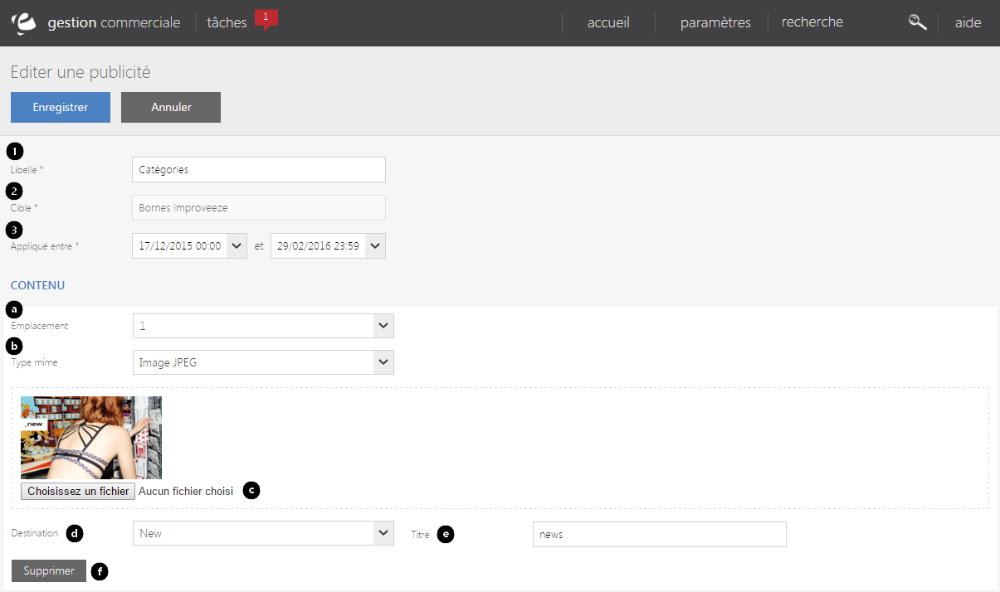

# Editer une publicité web

Ce formulaire vous <strong>permet de modifier les informations d'une&nbsp;campagne.</strong>

Pour acc&eacute;der &agrave; ce formulaire, il vous suffit de cliquez sur le bouton bleu <strong>Ouvrir</strong> lorsque vous &eacute;tes sur la premi&egrave;re page.

Dans ce formulaire, vous pourrez <strong>modifier vos informations de bases</strong> (libell&eacute;, cible, date d'application) ou encore le <strong>contenu de votre&nbsp;campagne.</strong>

<blockquote>

A savoir : chaque bloc de contenu correspond &agrave; une publicit&eacute; se trouvant dans votre campagne.

</blockquote>

Vous pouvez voir dans ce formulaire :

<ol>
<li>Le <strong>libell&eacute;</strong> de l'op&eacute;ration,</li>
<li>La <strong>cible</strong> (site e-commerce, magasin...),</li>
<li>La <strong>date d'application</strong> <strong>de cette op&eacute;ration</strong> (date de d&eacute;but et date de fin).</li>
</ol>

Vous pouvez aussi <strong>modifier le contenu de votre op&eacute;ration commerciale</strong> via les crit&egrave;res suivant :

<ol type="a">
<li>Sa <strong>position dans la page</strong> (important ou secondaire).</li>
<li>Le <strong>type du</strong> <strong>fichier</strong> &agrave; inclure (image JPEG, PNG...).</li>
<li><strong>D&eacute;poser le fichier &agrave; cet emplacement.</strong></li>
<li><strong>L'URL du site.</strong></li>
<li>Le <strong>titre</strong> du fichier.</li>
</ol>

Vous pouvez supprimer un contenu de votre op&eacute;ration commerciale gr&acirc;ce au bouton "<strong>Supprimer</strong>". (f)

Pour introduire un nouveau&nbsp;bloc de contenu, cliquez sur la <strong>commande d'action</strong>&nbsp;<strong>&gt; Ajouter, </strong>pour terminer, cliquez sur le bouton bleu "<strong>Enregistrer</strong>".&nbsp;

&nbsp;

