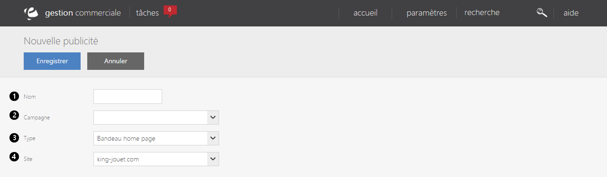

# Publicité cross-canal

Ce formulaire vous permet de <strong>cr&eacute;er une nouvelle publicit&eacute;</strong> qui apparaitra sur votre site e-commerce.

Pour cr&eacute;er une nouvelle publicit&eacute;, il vous suffit de remplir les crit&egrave;res suivant :

<ol>
<li>Le <strong>nom</strong> que vous souhaitez donner &agrave; cette publicit&eacute;,</li>
<li>Le <strong>type de campagne</strong> (op&eacute;ration no&euml;l, solde...),</li>
<li>Le <strong>type de publicit&eacute;</strong> (Pub magasin, pub opportuniste...),</li>
<li>Le <strong>site e-commerce</strong> ou l'on peut l'appercevoir.</li>
</ol>

Pour terminer cette nouvelle publicit&eacute;, cliquez sur le bouton bleu <strong>Enregistrer</strong>.

