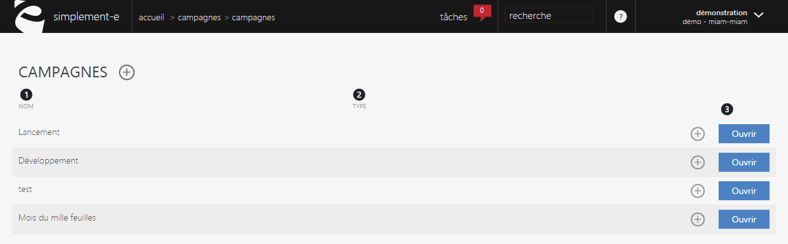

# Gérer mes campagnes

Une campagne correspond &agrave; un<strong> regroupement par th&egrave;me d'op&eacute;rations commerciales, publicit&eacute;s...</strong>

En cliquant sur "<strong>G&eacute;rer mes campagnes</strong>" dans le menu de commande, vous serez redirig&eacute; vers une page vous permettant de <strong>visualiser et de modifier l'int&eacute;gralit&eacute; de vos campagnes</strong>.

Dans cette page, vous pourrez <strong>retrouver vos campagnes, les modifier ou en cr&eacute;er</strong>.

Vous pouvez trouver dans cette page :

<ol>
<li>La liste des noms de vos op&eacute;rations commerciales,</li>
<li>Le type d'opp&eacute;ration (pub, promotion...),</li>
</ol>

Pour modifier une op&eacute;ration commerciale, cliquez sur le bouton bleu <a href="/fr-fr/office/gestion-commerciale/commercial/campagnes/editcampagne.aspx">Ouvrir</a>. (3)

Vous serez redirig&eacute; vers un <a href="/fr-fr/office/gestion-commerciale/commercial/campagnes/editcampagne.aspx">formulaire d'&eacute;dition</a>&nbsp;vous permettant de modifier les informations de votre op&eacute;ration commerciale.

