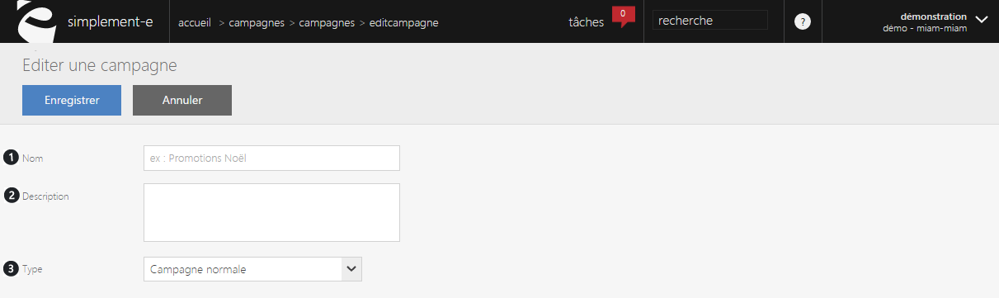

# Nouvelle campagne

<h3>Cr&eacute;ation d'une nouvelle campagne</h3>

Pour <strong>cr&eacute;er une campagne</strong>, cliquez sur le bouton bleu <strong>Ouvrir</strong> sur la droite de votre op&eacute;ration.

Ce formulaire va vous permettre de cr&eacute;er une nouvelle campagne.

Pour cr&eacute;er une <strong>nouvelle campagne</strong>, vous devez cliquer sur le <strong>menu de commande</strong> et choisir "<strong>Nouvelle campagne</strong>".

Dans ce formulaire vous pouvez avoir :

<ol>
<li>Le nom de l'op&eacute;ration que vous souhaitez cr&eacute;er,</li>
<li>La description de celle-ci,</li>
<li>Le type de campagne :</li>
</ol>

- Campagne normale, qui reste pour un certain temps.

- Campagne permanente.

Pour terminer votre nouvelle campagne, cliquez sur le bouton bleu <strong>Enregistrer</strong>.

