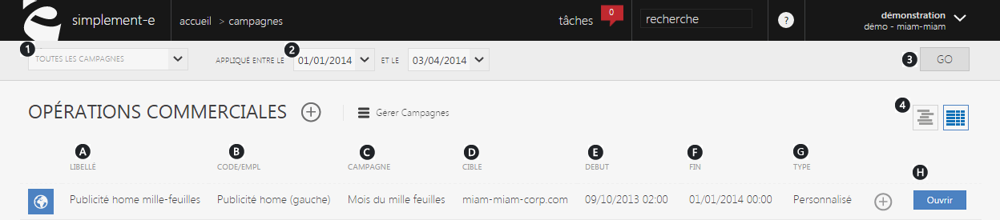
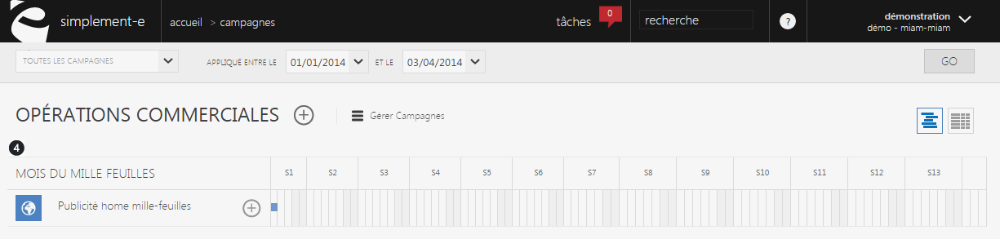
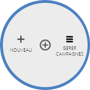
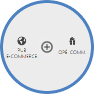

# Recherche et création

Une <strong>campagne</strong> correspond &agrave; un <strong>regroupement d'op&eacute;rations commerciales</strong>.

Cette partie vous permet de <strong>visualiser l'int&eacute;gralit&eacute; de vos op&eacute;rations commerciales</strong>; de <strong>cr&eacute;er</strong>, <strong>rechercher</strong> et les <strong>g&eacute;rer</strong>.

De cette page, vous pouvez <strong>rechercher un &eacute;v&eacute;nement commercial </strong>(publicit&eacute;, promotions, soldes...) rapidement gr&acirc;ce &agrave; la <em>barre de recherche</em> situ&eacute; sur le haut de la page.

Vous pouvez aussi <strong>cr&eacute;er</strong> une nouvelle s&eacute;lection via la <strong>commande d'action.</strong>

<h3>Rechercher une op&eacute;ration commerciale</h3>

Vous pouvez lancer une recherche avec les crit&egrave;res suivants :

<ol>
<li>Diff&eacute;rents types de campagnes</li>
<li>Date d'application de cette op&eacute;ration</li>
</ol>

Pour lancer la recherche, cliquez sur le bouton de lancement "<strong>Go</strong>" (3)

Ces crit&egrave;res vous permettront de rechercher une s&eacute;lection rapidement&nbsp;via les informations dont vous disposez.

Vous pouvez aussi affich&eacute; vos op&eacute;rations commerciales sous la forme d'un <strong>GANTT</strong> (5) et d'un <strong>tableur</strong>. (4)

<blockquote>

A savoir : un GANTT est un outil utilis&eacute; en ordonnancement et en gestion, permettant de visualiser dans le temps divers t&acirc;ches ou projet.

</blockquote>
<h3>Vos op&eacute;rations commerciales</h3>

Cette partie vous donne acc&egrave;s &agrave;<strong> l'int&eacute;gralit&eacute; de vos op&eacute;rations commerciales</strong>, elle vous permet de les <strong>modifier</strong> ou encore <strong>d'acc&eacute;der &agrave; l'ensemble de leurs informations</strong>.

Vous pouvez voir :

<ol>
<li>Leur <strong>libell&eacute;</strong>,</li>
<li>Leur <strong>code</strong>,</li>
<li>Les <strong>op&eacute;rations actives</strong>,</li>
<li>La <strong>cible</strong> (le site e-commerce),</li>
<li>Le <strong>d&eacute;but de celle-ci</strong>,</li>
<li>Sa <strong>fin</strong>,</li>
<li>Le <strong>type d'op&eacute;ration</strong> (pub, promotion...).</li>
</ol>

Pour acc&eacute;der aux informations d'une op&eacute;ration ou pour les modifier, cliquez sur le bouton bleu "<strong>Ouvrir</strong>". (H)

<h3>Actions</h3>

Le <strong>menu d'action</strong>&nbsp;que vous pouvez apercevoir pr&egrave;s du titre, correspond au menu de commande.

Ce menu vous permet d'acc&eacute;der &agrave; diff&eacute;rentes commande qui vous permettront de g&eacute;rer vos articles.

<em>Exemple</em> de commande que vous pouvez avoir :

<table>
<tbody>
<tr>
<td><strong><a href="/app/gestion-commerciale/commercial/campagnes/campagnes.aspx">G&eacute;rer vos campagnes</a></strong></td>
<td>&nbsp;Cette action permet de g&eacute;rer la totalit&eacute; de vos campagnes</td>
</tr>
<tr>
<td><strong>Nouveau</strong></td>
<td>&nbsp;Cette action vous permet de cr&eacute;er de nouvelles op&eacute;rations commerciales</td>
</tr>
<tr>
<td style="padding-left: 30px;">- <a title="PUB e-commerce" href="/app/gestion-commerciale/commercial/campagnes/NouvelleIntraSite.aspx"><strong>Pub e-commerce</strong>&nbsp;</a></td>
<td>&nbsp;Cette action vous permet de cr&eacute;er une nouvelle publicit&eacute;</td>
</tr>
<tr>
<td style="padding-left: 30px;">- <strong><a href="/app/gestion-commerciale/commercial/campagnes/CampagneGuid.aspx">Op&eacute;. Commerciale</a></strong></td>
<td>&nbsp;Cette action vous permet de cr&eacute;er une nouvelle op&eacute;ration commerciale</td>
</tr>
</tbody>
</table>

&nbsp;

<h2>Cr&eacute;er ou g&eacute;rer une campagne</h2>

Pour cr&eacute;er ou g&eacute;rer une op&eacute;ration commerciale, cliquez sur la <strong>commande d'action</strong>&nbsp;pr&egrave;s du titre.

Lorsque vous cliquerez sur la <strong>commande d'action,</strong> vous aurez le choix entre plusieurs types de s&eacute;lections :

<table>
<tbody>
<tr>
<td><a title="G&eacute;rer vos campagnes" href="/app/gestion-commerciale/commercial/campagnes/campagnes.aspx"><strong>&nbsp;G&eacute;rer vos campagnes </strong></a></td>
<td>Cette action permet de g&eacute;rer l'integralit&eacute; de&nbsp;vos actions&nbsp;commerciales&nbsp;</td>
</tr>
<tr>
<td><strong>&nbsp;Nouvelle&nbsp;</strong></td>
<td>Cette action permet de cr&eacute;er une nouvelle op&eacute;ration commerciale</td>
</tr>
<tr>
<td style="padding-left: 30px;">- <a href="/app/gestion-commerciale/commercial/campagnes/NouvelleIntraSite.aspx"><strong>Pub e-commerce</strong> </a></td>
<td>

Cette action vous permet de cr&eacute;er une nouvelle publicit&eacute; e-commerce&nbsp;

</td>
</tr>
<tr>
<td style="padding-left: 30px;">-<a title="Op&eacute;. Commerciale" href="/app/gestion-commerciale/commercial/campagnes/CampagneGuid.aspx"><strong> Op&eacute;. Commerciale</strong>&nbsp;</a></td>
<td>Cette action vous permet de cr&eacute;er de nouvelle op&eacute;ration commerciale&nbsp;</td>
</tr>
</tbody>
</table>

Apr&egrave;s avoir choisis une s&eacute;lection, vous serez redirig&eacute; vers un <strong>formulaire</strong> vous permettant de d&eacute;buter la cr&eacute;ation de votre nouvelle s&eacute;lection.

