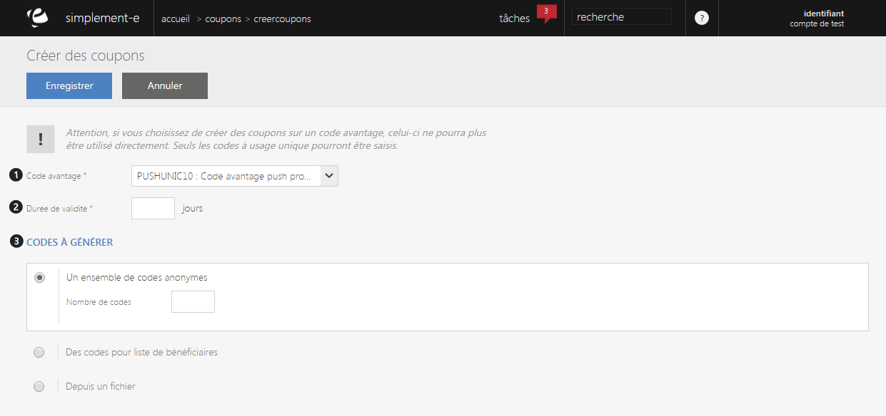
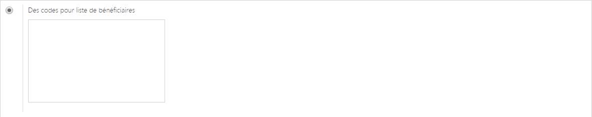
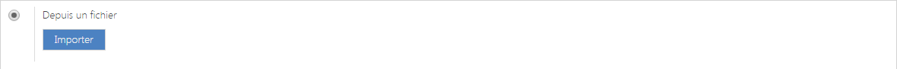
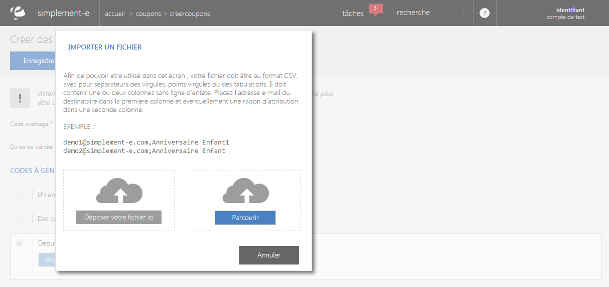

# Création d'un coupon

Vous serez redirig&eacute; vers un<strong> formulaire d'&eacute;dition</strong> vous permettant de <strong>cr&eacute;er un ou plusieurs nouveaux coupons</strong>.

Vous retrouverez dans ce formulaire :

<ol>
<li>Le <strong>code avantage</strong> du coupon (livraison offerte...),</li>
<li>Sa<strong> dur&eacute;e de validit&eacute;</strong>,</li>
<li>Vous pouvez aussi pr&eacute;ciser le code &agrave; g&eacute;n&eacute;rer :</li>
</ol>

- Un <strong>ensemble de code anonymes</strong>,&nbsp;ceci permet de g&eacute;n&eacute;rer des codes sans &ecirc;tre associ&eacute; &agrave; un client.

 - Des<strong> codes pour une liste de b&eacute;n&eacute;ficiaires</strong>, ceci permet d'associer une ou plusieurs adresse mail &agrave; vos coupons.

&nbsp;

&nbsp;

- Un <strong>fichier particulier&nbsp;permet d'importer une liste de b&eacute;n&eacute;ficiaire.</strong>

&nbsp;

Un<strong> pop-up</strong> s'affichera sur la page afin de pouvoir importer le fichier via "<strong>Parcourir</strong>" ou d'en d&eacute;poser une liste de b&eacute;n&eacute;ficaire&nbsp;via "<strong>D&eacute;poser votre fichier ici</strong>".

Pour valider votre cr&eacute;ation de coupon, cliquez sur le bouton bleu <strong>Enregistrer</strong>.

