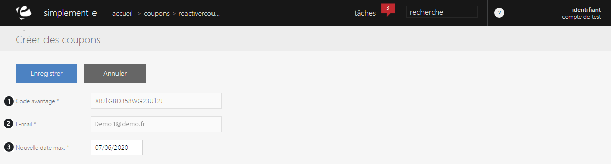

# Réactiver un coupon

<h3>R&eacute;activer un coupon</h3>

Pour r&eacute;activer un coupon, cliquez sur la <strong>commande d'action</strong> plus sur la droite d'un coupon et cliquez sur "<strong>R&eacute;activer</strong>".

Vous serez redirig&eacute; vers un formulaire vous permettant de remettre en fonction un coupon consomm&eacute;.

<blockquote>

A savoir: vous pouvez r&eacute;activer un coupon dont la date de consommation est d&eacute;pass&eacute;.

</blockquote>

Vous retrouverez dans ce formulaire :

<ol>
<li>Le code avantage du coupon,</li>
<li>L'e-mail du client b&eacute;n&eacute;ficiaire,</li>
<li>La nouvelle date de validit&eacute; du coupon.</li>
</ol>

Pour terminer la r&eacute;activation du coupon, cliquez sur le bouton bleu <strong>Enregistrer</strong>.

<blockquote>

A savoir : un coupon d&eacute;sativer est un coupon barr&eacute;

</blockquote>

