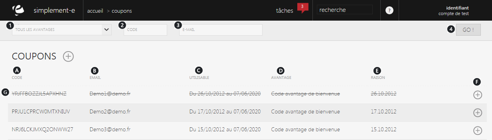

# Recherche

Un coupon permet de <strong>d&eacute;clencher une action promotionnelle </strong>li&eacute;&nbsp;&agrave; une <a href="/fr-fr/office/gestion-commerciale/commercial/Operationcommerciale/">op&eacute;ration commerciale </a>le coupon peut prendre la forme d'une montant fixe ou d'un taux de r&eacute;duction.

Dans cette page, vous retrouverez les <strong>diff&eacute;rents codes &agrave; usage unique</strong>.

Vous pouvez rechercher un coupon via la barre de recherche situ&eacute; sur le haut de la page.

Vous pourrez aussi <strong>cr&eacute;er</strong> un nouveau coupon pour un client via la commande d'action <strong>(+).</strong>

<h3>Rechercher un coupon</h3>

Vous pouvez lancer une recherche avec les crit&egrave;res suivants :

<ol>
<li><strong>Tout vos avantages actifs,</strong></li>
<li>Le <strong>code</strong> du coupon,</li>
<li><strong>L'e-mail</strong> du client</li>
</ol>

Pour lancer la recherche, cliquez sur le bouton de lancement "<strong>Go</strong>" (4)

Ces crit&egrave;res vous permettront de rechercher un coupon rapidement via les informations dont vous disposez.

<h3>Vos coupons</h3>

Cette partie vous donne acc&egrave;s &agrave; <strong>l'int&eacute;gralit&eacute; de vos coupons</strong>.

Dans cette page, vous pouvez voir :

<ol type="a">
<li>Le <strong>code</strong> du coupon,</li>
<li><strong>L'e-mail</strong> du client,</li>
<li>La <strong>date de validit&eacute;</strong> du coupon,</li>
<li>Son <strong>code avantage</strong>,</li>
<li>La <strong>raison</strong> de la cr&eacute;ation du coupon,</li>
<li>Le <strong>menu de commande</strong> vous permettant de r&eacute;activer un coupon,</li>
<li><strong>Coupon utilis&eacute;.</strong></li>
</ol>

La <strong>commande d'action</strong> sur la droite d'un coupon, vous <strong>permet de <a href="/fr-fr/office/gestion-commerciale/commercial/coupons/ReactiverCoupon.aspx">r&eacute;activer </a>un coupon qui &eacute;tait d&eacute;sactiver</strong>.

<h3>&nbsp;Actions</h3>

La&nbsp;<strong>commande d'action</strong>&nbsp;que vous pouvez apercevoir pr&egrave;s du titre, correspond au menu de commande.

Ce menu vous permet d'acc&eacute;der &agrave; diff&eacute;rentes commande qui vous permettront de g&eacute;rer vos articles.

<em>Exemple</em> de commande que vous pouvez avoir :

<table>
<tbody>
<tr>
<td><strong><a href="/fr-fr/office/gestion-commerciale/commercial/coupons/EditCoupon.aspx">Cr&eacute;er </a></strong></td>
<td>Cette action vous permet de cr&eacute;er un nouveau coupon&nbsp;&nbsp;</td>
</tr>
</tbody>
</table>

