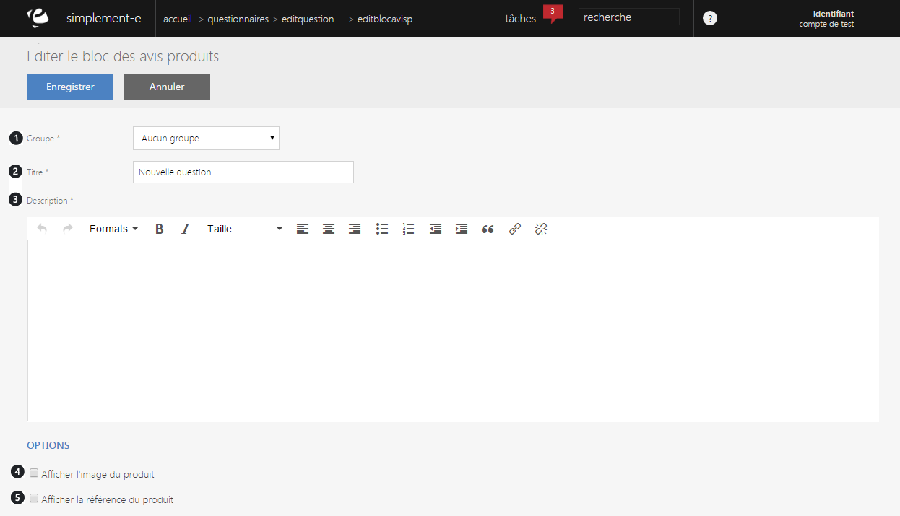

# Editer un bloc d'avis produits

<h3>MODIFIER OU AJOUTER UNE QUESTION</h3>

Lorsque vous cliquez sur le lien "<strong>Modifier</strong>" ou "<strong>Ajouter un &eacute;l&eacute;ment</strong>", vous serez redirig&eacute; vers un&nbsp;<strong>formulaire&nbsp;</strong>vous permettant de modifier les informations du bloc d'avis.

Ce formulaire vous permet de modifier certaines informations d'un questionnaire.

Un <strong>bloc d'avis vous permet de&nbsp;cr&eacute;er une question permettant au client de donner son avis</strong> sur le produit, la livraison...

Vous trouverez dans ce formulaire :

<ol>
<li>Le&nbsp;groupe&nbsp;auquel il appartient,</li>
<li>Le&nbsp;titre&nbsp;du bloc d'avis,</li>
<li>La&nbsp;description&nbsp;(question).</li>
</ol>

Vous pouvez aussi afficher l'image du produit (4)&nbsp;ainsi que sa r&eacute;f&eacute;rence (5) via les cases de la partie "<strong>Options</strong>".

Pour terminer votre modification ou votre ajout, cliquez sur "<strong>Enregistrer</strong>".

