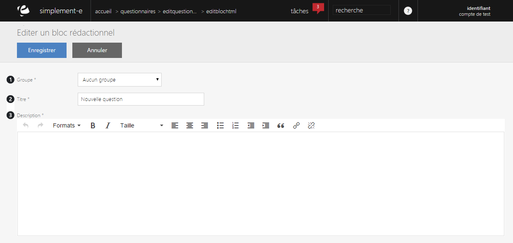

# Editer un bloc rédactionnel

<h3>Modifier ou ajouter une question</h3>

Lorsque vous cliquez sur le lien "<strong>Modifier</strong>" ou "<strong>Ajouter un &eacute;l&eacute;ment</strong>", vous serez redirig&eacute; vers un <strong>formulaire</strong> vous permettant de modifier les informations du bloc de r&eacute;daction.

Ce formulaire vous permet de modifier certaines informations d'un questionnaire.

Un bloc de r&eacute;daction HTML vous permet de <strong>cr&eacute;er un message de remerciement</strong> &agrave; l'encontre des clients.

Vous trouverez dans ce formulaire :

<ol>
<li>Le <strong>groupe</strong> auquel il appartient,</li>
<li>Le <strong>titre</strong> du bloc r&eacute;dactionnel,</li>
<li>La <strong>description</strong> (remerciement).</li>
</ol>

Pour terminer votre modification ou votre ajout, cliquez sur "<strong>Enregistrer</strong>".

&nbsp;

