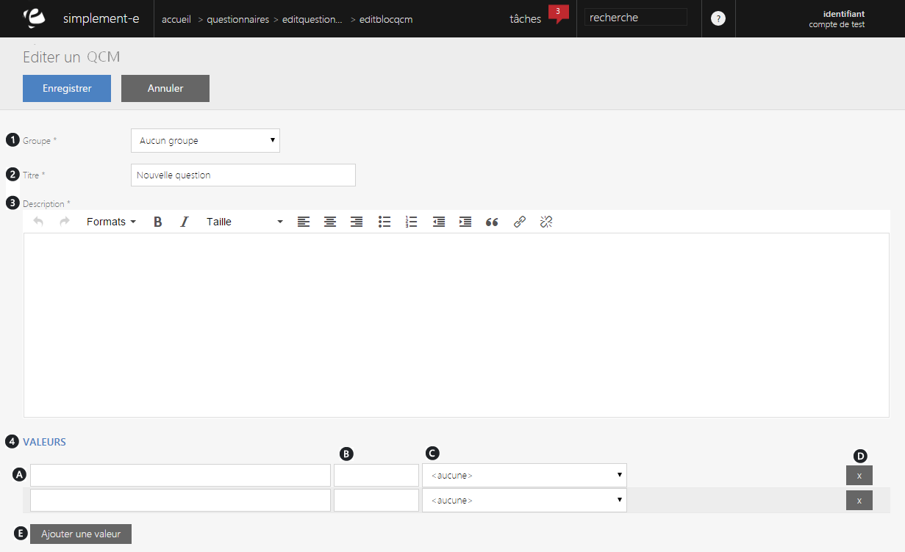

# Editer un QCM

<h3>Modifier ou ajouter une question</h3>

Lorsque vous cliquez sur le lien "<strong>Modifier</strong>" (2) ou "<strong>Ajouter un &eacute;l&eacute;ment</strong>", vous serez redirig&eacute; vers un formulaire vous permettant de <strong>modifier les informations du bloc de r&eacute;daction</strong>.

Ce formulaire vous permet de <strong>modifier certaines informations d'un questionnaire</strong>.

Vous pourrez modifier la question que vous souhaitez poser ainsi que les diff&eacute;rentes r&eacute;ponses que vous proposerez &agrave; vos clients lorsqu'il sagit d'un QCM.

Vous trouverez dans ce formulaire :

<ol>
<li>Le groupe auquel il appartient,</li>
<li>Le titre du bloc QCM,</li>
<li>La description (question pos&eacute;e),</li>
<li>Les diff&eacute;rentes r&eacute;ponses propos&eacute;es :</li>
</ol>
<ol type="a">
<li>

Listes des r&eacute;ponses propos&eacute;es,

</li>
<li>

R&eacute;ponses apparentes,

</li>
<li>

Etat de la question (questionnaire r&eacute;pondu, report&eacute; la question...),

</li>
<li>

Lien de suppression d'une r&eacute;ponse,

</li>
<li>

Lien permettant d'ajouter une r&eacute;ponse.

</li>
</ol>

&nbsp;Lorsque vos modifications seront terminer, cliquez sur le bouton bleu <strong>Enregistrer</strong> pour terminer vos modifications.

&nbsp;

