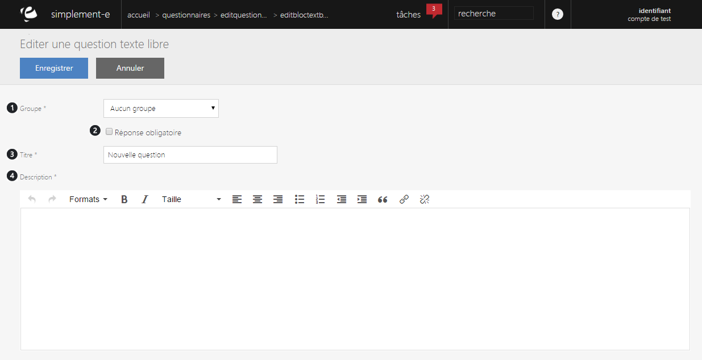

# Editer une question de texte libre

<h3>MODIFIER OU AJOUTER UNE QUESTION</h3>

Lorsque vous cliquez sur le lien "<strong>Modifier</strong>" ou "<strong>Ajouter un &eacute;l&eacute;ment</strong>", vous serez redirig&eacute; vers un&nbsp;<strong>formulaire&nbsp;</strong>vous permettant de modifier les informations du bloc de texte libre.

Ce formulaire vous permet de modifier certaines informations d'un questionnaire.

Un bloc de texte libre permet au client de r&eacute;pondre &agrave; votre question sans limitation de mot et sans proposition de r&eacute;ponse.

Vous trouverez dans ce formulaire :

<ol>
<li>Le&nbsp;groupe&nbsp;auquel il appartient,</li>
<li>En cochant cette case, le client sera obliger de r&eacute;pondre afin de terminer le questionnaire.</li>
<li>Le&nbsp;titre&nbsp;du bloc de texte libre,</li>
<li>La&nbsp;description&nbsp;(question).</li>
</ol>

Pour terminer votre modification ou votre ajout, cliquez sur "<strong>Enregistrer</strong>".

&nbsp;

