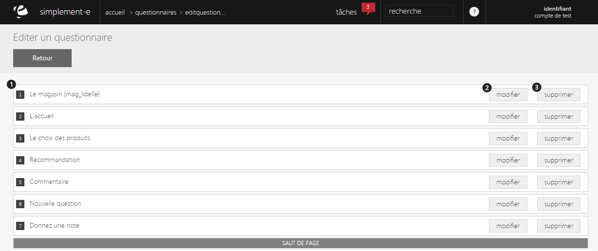
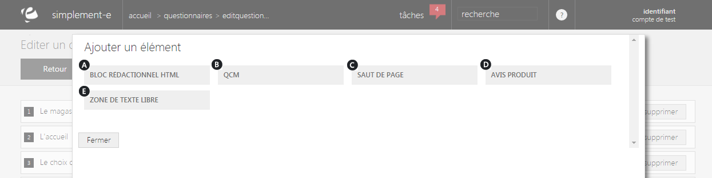

# Modifier un questionnaire

Ce formulaire vous permet de <strong>visualiser et de modifier les diff&eacute;rents &eacute;l&eacute;ments d'un questionnaire</strong>.

Dans cette page, vous trouverez la liste des <strong>diff&eacute;rentes questions pos&eacute;es</strong>, un lien permettant d'en <strong>modifier une </strong>(2) ou encore un <strong>lien de suppression</strong>. (3)

&nbsp;Vous pouvez aussi ajouter un &eacute;l&eacute;ment &agrave; votre questionnaire, pour cela, cliquez sur "<strong>Ajouter un &eacute;l&eacute;ment</strong>" sur le bas de la page.

<h3>Ajout d'un &eacute;l&eacute;ment</h3>

Lorsque vous cliquez sur "<strong>Ajouter un &eacute;l&eacute;ment</strong>", un <strong>pop-up apparaitra sur la page</strong>.

Ce pop-up vous donnera acc&egrave;s &agrave; diff&eacute;rents &eacute;l&eacute;ments que vous pourrez inclure dans votre questionnaire.

Vous pouvez avoir :

<ol type="a">
<li>Un<a href="/app/gestion-commerciale/commercial/questionnaires/EditBlocHtml.aspx"> bloc de r&eacute;daction HTML</a>,</li>
<li>Un <a href="/app/gestion-commerciale/commercial/questionnaires/EditBlocQcm.aspx">QCM</a>,</li>
<li>Un saut de page,</li>
<li>Un <a href="/app/gestion-commerciale/commercial/questionnaires/EditBlocAvisProduits.aspx">avis produit</a>,</li>
<li>Une <a href="/app/gestion-commerciale/commercial/questionnaires/EditBlocTextBlock.aspx">zone de texte libre</a>.</li>
</ol>

Lorsque vous cliquez sur l'un des &eacute;l&eacute;ments, vous serez redirig&eacute; vers le <strong>formulaire</strong> ad&eacute;quat pour la cr&eacute;ation du nouvel &eacute;l&eacute;ment.

&nbsp;

