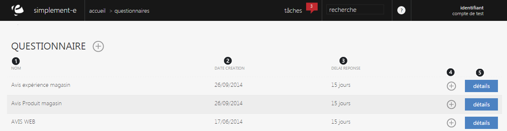

# Vos questionnaires

Un <strong>questionnaire permet de vous informer sur les ressentis et les attentes de vos clients</strong>.

Dans cette page, vous retrouverez <strong>l'int&eacute;gralit&eacute; de vos questionnaires</strong>.

Vous retrouverez dans cette page :

<ol>
<li>Le <strong>nom</strong> du questionnaire,</li>
<li>Sa <strong>date de cr&eacute;ation</strong>,</li>
<li>Le <strong>d&eacute;lai de r&eacute;ponse</strong> pour un questionnaire,</li>
<li>Le <strong>menu de commande</strong> permettant <strong>d'afficher les d&eacute;tails de r&eacute;ponse</strong> ou de <strong>modifier un questionnaire,</strong></li>
<li><strong>Les d&eacute;tails du questionnaire.</strong></li>
</ol>
<h3>Actions</h3>

La&nbsp;<strong>commande d'action&nbsp;</strong>que vous pouvez apercevoir pr&egrave;s du titre, correspond au menu de commande.

Il vous permet d'acc&eacute;der &agrave; diff&eacute;rentes actions qui vous permettront de g&eacute;rer votre activit&eacute;.

<em>Exemple</em> de commande que vous pouvez avoir :

<table>
<tbody>
<tr>
<td><a href="/fr-fr/office/gestion-commerciale/commercial/questionnaires/NouveauQuestionnaire.md">Nouveau&nbsp;</a></td>
<td>&nbsp;Cette action vous permet de cr&eacute;er un nouveau questionnaire.</td>
</tr>
</tbody>
</table>

