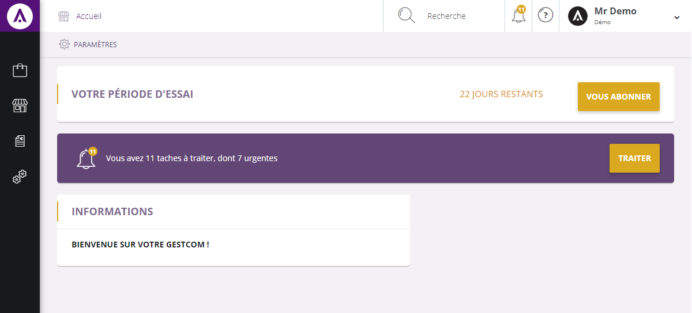

# Accueil

<strong>L'accueil</strong> correspond &agrave; la barre sup&eacute;rieur noir que vous obtenez apr&egrave;s votre connexion.

De cette barre, vous pouvez acc&eacute;der :

-&nbsp;A votre <strong>gestion commerciale</strong>,

- Vos <strong>t&acirc;ches,</strong>

- Vos <strong>param&egrave;tres de compte</strong>,

- A <strong>l'aide</strong>,

- Et la <strong>recherche</strong> <strong>d'article</strong>.

<h3>Acc&eacute;der aux fonctions de votre Gestion commerciale</h3>

Cette barre vous permet d'acc&eacute;der aux fonctionnalit&eacute;es de votre <strong>gestion commerciale.</strong>

Pour acc&eacute;der &agrave; votre gestion commerciale, vous devez aller sur l'ic&ocirc;ne:

<ol>
<li>" <strong>Simplement-e </strong>"</li>
</ol>
<h3>Accueil</h3>

Vous pouvez &agrave; tout moment retourner en arri&egrave;re gr&acirc;ce &agrave; l'ic&ocirc;ne:

&nbsp;&nbsp;&nbsp;&nbsp;&nbsp; 2.&nbsp; " <strong>Accueil </strong>"

<h3>Acc&eacute;der aux t&acirc;ches</h3>

De cette page, vous avez aussi acc&egrave;s aux t&acirc;ches que vous avez &agrave; accomplir. Pour les consulter, il vous suffit de cliquer sur l'ic&ocirc;ne:

&nbsp;&nbsp;&nbsp;&nbsp;&nbsp; 3.&nbsp; " <a title="T&acirc;ches" href="/fr-fr/office/gestion-commerciale/todolist.html"><strong>T&acirc;ches</strong> </a>"

Cet ic&ocirc;ne vous permettra d'acc&eacute;der &agrave; vos t&acirc;ches et ainsi de conna&icirc;tre l'importance et la dur&eacute;e de celle-ci, gr&acirc;ce notamment &agrave; votre "<strong>todo-list</strong>".

<h3>Rechercher un &eacute;l&eacute;ment et affiner vos recherches</h3>

Vous disposez d'une <strong>barre de recherche</strong> qui vous permettra de <strong>rechercher</strong> un article que vous souhaitez trouver rapidement. Pour ce faire, il vous suffit de vous rendre sur l'ic&ocirc;ne :

&nbsp;&nbsp;&nbsp;&nbsp;&nbsp; 4.&nbsp; " <strong>Recherche</strong> " avec la petite loupe.

<h3>&nbsp;Dispositif d'aide</h3>

Si des choses sont difficile &agrave; comprendre, une<strong> aide en ligne</strong> est &agrave; votre enti&egrave;re disposition. Vous devez juste cliquer sur l'ic&ocirc;ne :

&nbsp;&nbsp;&nbsp;&nbsp;&nbsp; 5.&nbsp; &nbsp;" <a title="Aide" href="/"><strong>?</strong></a> " et vous serez redirig&eacute; vers le site explicatif.

<h3>Votre identifiant</h3>

De cette barre, vous avec acc&egrave;s &agrave; votre identifiant (nom de compte) ainsi qu'au site auquel il est rattach&eacute;.

&nbsp;&nbsp;&nbsp;&nbsp;&nbsp;&nbsp; 6. " <strong>Identifiant</strong> "

<h3>Acc&eacute;der &agrave; vos param&egrave;tres de compte</h3>

La page d'accueil vous permet aussi d'acc&eacute;der &agrave; vos param&egrave;tres de compte et ainsi modifier vos crit&egrave;res, votre page d'accueil ou encore consulter vos donn&eacute;es personnelles. Pour acc&eacute;der &agrave; cette page, il vous suffit de saisir le lien:&nbsp;

&nbsp;&nbsp;&nbsp;&nbsp;&nbsp; 7.&nbsp; &nbsp;"<strong>&nbsp;<a href="/fr-fr/office/settings/">&gt;</a></strong> " vous pourrez acc&eacute;der &agrave; vos param&egrave;tre de compte ou vous d&eacute;connectez.

