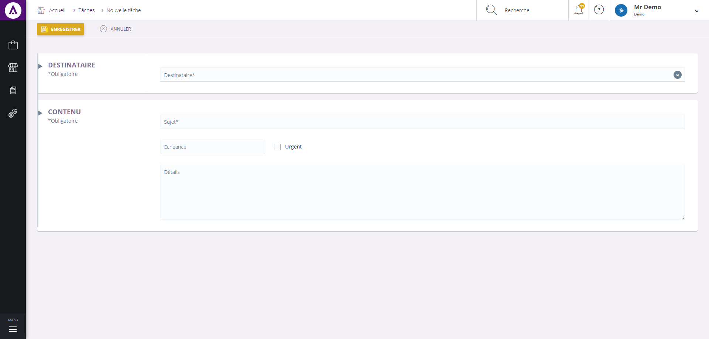

# Créer une tâche

Ce formulaire vous permet de **créer une tâche**, pour en éditer une nouvelle, vous devrez saisir les informations suivantes :

1.  Destinataire.
2.  Sujet sur lequel traite la tâche.
3.  Case permettant de préciser si la tâche est urgente à traiter ou non.
4.  La date d'échéance.
5.  Les détails de la tâche.

Pour terminer votre création, cliquez sur **Enregistrer**, votre tâche sera créée et envoyée au destinataire.