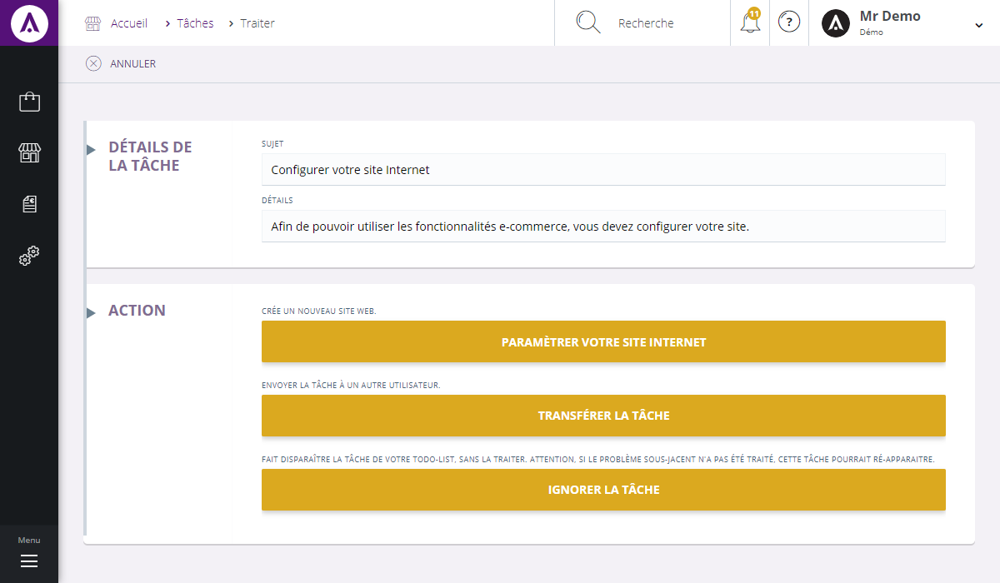

# Traiter une tâche

Dans cette page, vous serez en mesure de<strong> traiter une t&acirc;che</strong>.

Pour r&eacute;aliser la t&acirc;che choisie, allez sur la commande d'action d'une t&acirc;che puis cliquer sur&nbsp;" <strong>Traiter</strong> ", une page pr&eacute;sentant toutes les actions possibles vous sera alors propos&eacute;e.

<blockquote>

A savoir : vos droits sont param&egrave;trables

</blockquote>

En cliquant sur <strong>Traiter</strong>, vous aurez acc&egrave;s &agrave; diff&eacute;rentes actions, comme :

<ul>
<li>Ouvrir le dossier</li>
<li>Marquer comme termin&eacute;</li>
<li>Transf&eacute;rer la t&acirc;che</li>
<li>Ignorer la t&acirc;che</li>
</ul>
<blockquote>

A savoir : les actions sont param&egrave;trables

</blockquote>

&nbsp;

