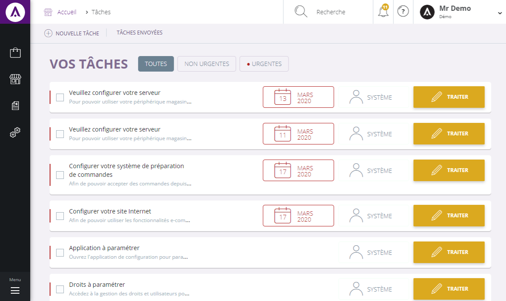

# Liste des tâches

La " _todo_-_list_ " vous permet de **visualiser les tâches** que vous avez à effectuer ainsi que de les traiter,  afin de mieux gérer votre temps de travail.

Vous y retrouvez des tâches :

 - **automatiques**, affectées par votre gestion commerciale en fonction de votre activité.  

- **créées** par vos soins ou envoyées par vos collègues.

### Accéder à vos tâches

Les tâches sont facilement accessibles depuis tous les écrans grâce à l'icône " **tâche**" située dans la barre de menu supérieur.

Dans cette page, vous retrouvez l'intégralité de vos tâches, affichées par ordre de priorité et d'échéance.

Pour connaître toute les opérations possible afin de traiter une tâche, cliquez sur **la commande d'action** :

> A savoir : si vous avez plus de 250 tâches en attentes, seules les 250 premières seront affichées, terminez en quelques une pour obtenir les suivantes.

### Traiter une tâche

Pour réaliser la tâche choisie, allez sur " **Traiter** ", une page présentant toutes les actions possible (en fonction de vos droits) vous sera alors proposée.

> A savoir : les actions disponibles sont paramétrables.

### Transférer une tâche

Si vous pensez ne pas être la personne la plus apte à traiter la tâche, vous pouvez la transférer vers un utilisateur plus compétant.

Pour cela, il vous suffit de cliquer sur " **Transférer la tâche** ".

Vous pouvez choisir à ce moment le destinataire et compléter en cas de besoin le descriptif.

> A savoir : lors d'un transfert de tâche, vous êtes marqué en tant qu'expéditeur, votre destinataire pourra ainsi vous contacter pour plus d'information.

Vous pouvez **ignorer une tâche**, en l'ignorant vous la supprimerez de votre _todo-list_.

### Envoyer une tâche

 L'une des fonctionnalitées les plus intéressante de la _todo-list_ est la possibilté pour les utilisateurs de **s'envoyer des tâches** pour un élément de la gestion commerciale.

Pour cela, vous devez cliquer sur la **commande d'action** se trouvant près de la tête de page " **Vos tâches** ".

A partir de là, vous pouvez **retrouver des tâches** que vous avez déjà envoyé.

Pour retrouver une tâche déjà envoyé, il vous suffit de remplir les 3 critères demandé :

- Le **libellé** de la tâche,

- Le **destinataire**,

- La **date de création** de la tâche.

Vous pouvez aussi **envoyer une tâche** depuis un dossier client ou de commande au service financier afin qu'il vérifie auprès de leur banque qu'un règlement a bien été encaissé.

Pour envoyer une tâche, il vous faut préciser le destinataire, le sujet ainsi que plus de précision de celle-ci dans la partie " _détails_ ".

Lorsque vous cliquerez sur " **Envoyer** ", vous allez automatiquement créer une tâche dans la _todo-list_ de l'utilisateur sélectionné.

> A savoir : comme lors d'un transfert de tâche, vous êtes marqué en tant qu'expéditeur lorsque vous envoyez une tâche, votre destinataire pourra ainsi vous contacter pour plus de renseignements.