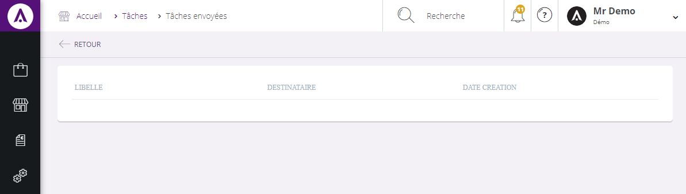

# Tâches envoyées

Dans cette page, vous trouverez **l'intégralité des tâches que vous avez envoyées à vos collaborateurs**.

Les tâches sont triées selon trois catégories :

1.  Leur libellé,
2.  Leur destinataire,
3.  Leur date de création.

Pour visualiser l'intitulé de la tâche, cliquez sur le bouton bleu **Ouvrir** à droite de la tâche, vous serez en mesure **d'accéder à ces informations** et de **visualiser son avancement**.