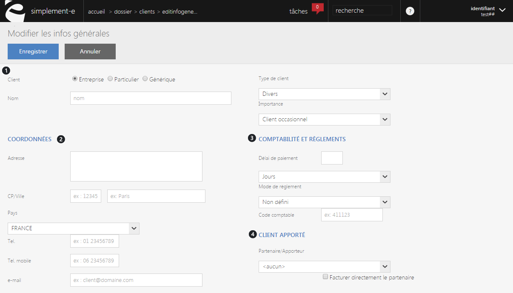

# Créer ou modifier un client

Ce formulaire vous permettra de **définir les informations d'un client.**

Dans ce formulaire, vous pouvez voir :

1.  **Les informations concernant le client** :

-  Sa particularité (client particulier, professionnel, générique).

-  Son nom (ou prénom lorsqu'il s'agit d'un particulier).

-  Le type de client (divers, client service...).

-  Son importance (VIP, occasionnel, régulier).

     2.   **Les informations concernant les coordonnées du client** :

-  Son adresse,

-  Son code postal, sa ville,

-  Son numéro de téléphone (fixe ou mobile),

-  Son e-mail.  

Vous pouvez accéder aussi aux informations professionnelles du client.

     3.  **Les informations de comptabilité et réglement :**

-  Délai de paiement (en jours),

-  Le mode de réglements (chéque, prélévement...),

-  Le code comptable.

     4.  **Le fait que le client soit apporté par un partenaire ou non**.

Pour terminer votre création ou votre modification, cliquez sur **Enregistrer**.