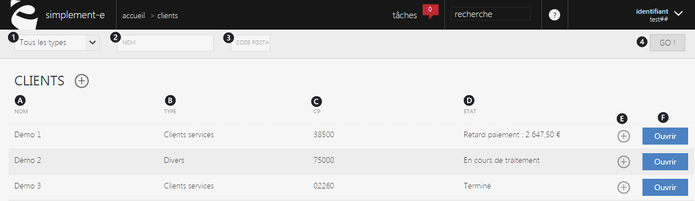

# Vos clients

Cette page vous permet de visualiser&nbsp;<strong>l'int&eacute;gralit&eacute; de vos clients</strong>, de les&nbsp;<strong>cr&eacute;er</strong>,&nbsp;<strong>rechercher&nbsp;</strong>et <strong>g&eacute;rer</strong>.

Vous pouvez rechercher un article rapidement gr&acirc;ce &agrave; la barre de&nbsp;recherche&nbsp;situ&eacute;e sur le haut de la page ou cr&eacute;er un nouvel article via la commande d'actions&nbsp;<strong>(+).&nbsp;</strong>

<h3>RECHERCHE D'UN ARTICLE</h3>

Vous pourrez lancer une recherche avec les crit&egrave;res suivants :

<ol>
<li>Tout les types de clients,</li>
<li>Le nom du client recherch&eacute;,</li>
<li>Son code postale.</li>
</ol>

Pour lancer la recherche, cliquez sur&nbsp;" <strong>GO</strong> ! "&nbsp;(4).

<h3>&nbsp;ARTICLES</h3>

Cette page vous donne acc&egrave;s &agrave;&nbsp;<strong>l'int&eacute;gralit&eacute;&nbsp;de&nbsp;vos&nbsp;clients</strong>,&nbsp;elle vous permet de les g&eacute;rer ou encore d'acc&egrave;der &agrave; leurs informations.

Vous pouvez voir :

<ol type="a">
<li>Le nom du client,</li>
<li>Son type (divers, clients services..),</li>
<li>Son code postal,</li>
<li>L'&eacute;tat de ses r&eacute;glement (en retard, termin&eacute;..),</li>
<li>Menu d'action permettant de modifier les informations d'un client.</li>
</ol>

Pour acc&eacute;der aux informations d'un dossier client, cliquez sur le lien bleu "&nbsp;<strong>Ouvrir&nbsp;</strong>" (F).

<h3>ACTIONS</h3>

La&nbsp;<strong>commande d'action&nbsp;</strong>que vous pouvez apercevoir pr&egrave;s du titre, correspond au menu de commande. Il vous&nbsp;permet d'acc&eacute;der &agrave; diff&eacute;rentes actions qui vous permettront de g&eacute;rer vos articles.

<em>Exemple&nbsp;</em>de commande dont vous pouvez disposer :

<table>
<tbody>
<tr>
<td><strong><a href="/fr-fr/office/gestion-commerciale/ventes/clients/editinfogenerales.aspx">Nouveau client</a> </strong></td>
<td>&nbsp;Cette action permet de cr&eacute;er un nouveau client.</td>
</tr>
</tbody>
</table>

&nbsp;

