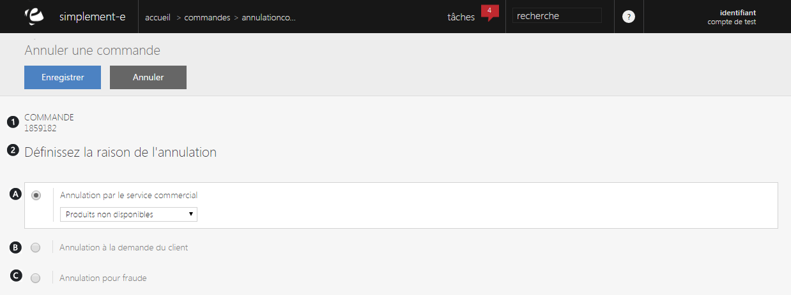

# Annulation d'une commande

Ce <strong>formulaire va vous permettre d'annuler une commande client</strong>, il vous suffira de pr&eacute;ciser la raison de cette annulation.

Vous pouvez avoir dans ce formulaire :

<ol>
<li>Le <strong>num&eacute;ro de la command</strong>e en question</li>
<li>Les <strong>diff&eacute;rentes raisons d'annulation</strong></li>
</ol>

Comme :

<ol type="a">
<li>Une <strong>annulation par le service commercial</strong> (risque de fraude trop important...)</li>
</ol>

&nbsp;&nbsp;&nbsp;&nbsp;&nbsp;&nbsp;&nbsp; b.&nbsp; Une <strong>annulation &agrave; la demande du client</strong> (produit ab&icirc;m&eacute;, non-conforme...)

&nbsp;&nbsp;&nbsp;&nbsp;&nbsp;&nbsp;&nbsp; c.&nbsp; Une <strong>annulation pour fraude.</strong>

&nbsp;

<blockquote>

A savoir : pour pr&eacute;ciser les raisons d&eacute;taill&eacute;es de cette annulation, utilisez la barre d&eacute;roulante.

</blockquote>

