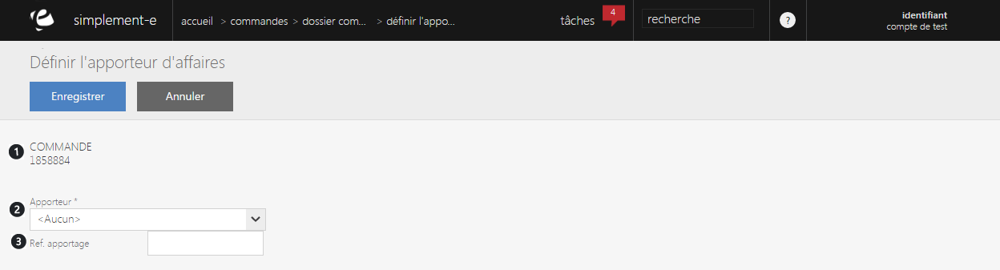

# Saisir l'apporteur d'affaires

Ce <strong>formulaire va vous permettre de d&eacute;finir l'apporteur d'affaires</strong>.

Un apporteur d'affaire est un <strong>organisme publicitaire</strong> charg&eacute; de "recruter" les clients et les <strong>inciter &agrave; visiter un site via les publicit&eacute;s qu'ils affichent</strong>.

Vous pouvez voir dans ce formulaire :

<ol>
<li>Le num&eacute;ro de la commande</li>
<li>Le nom de l'apporteur ou de son partenaire</li>
<li>La r&eacute;f&eacute;rence de celui-ci</li>
</ol>

