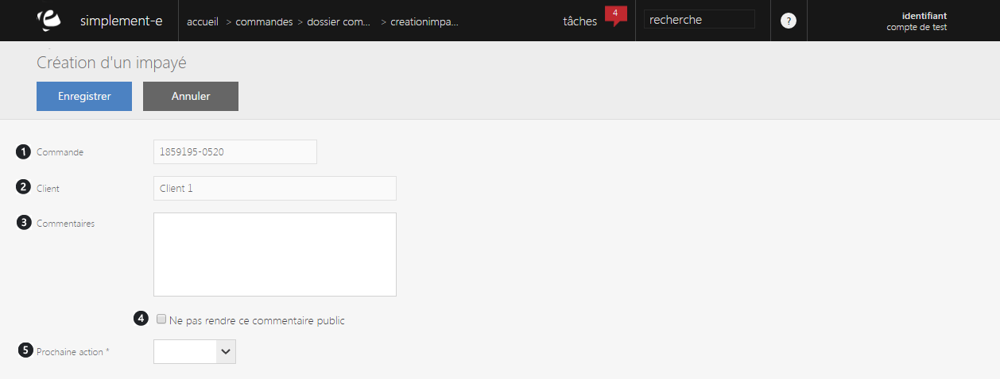

# Déclarer une commande impayée

Ce formulaire va vous permettre de <strong>d&eacute;clarer une commande comme impay&eacute;</strong>.

Vous devez pr&eacute;ciser le num&eacute;ro de la commande en question ainsi que le nom du client ayant fait cette commande, vous pouvez aussi laiss&eacute; un commentaire au client et lui pr&eacute;ciser les prochaines actions de paiement.

Vous pouvez voir dans ce formulaire :

<ol>
<li>Le num&eacute;ro de la commande impay&eacute;</li>
<li>Le nom du client</li>
<li>La partie&nbsp;commentaire expliquant le probl&egrave;me au client</li>
<li>Une case indiquant la visibilit&eacute; ou non du commentaire au public</li>
<li>La date de la prochaine action</li>
</ol>

Pour valider votre litige, cliquez sur le bouton bleu <strong>Enregistrer</strong>.

&nbsp;

