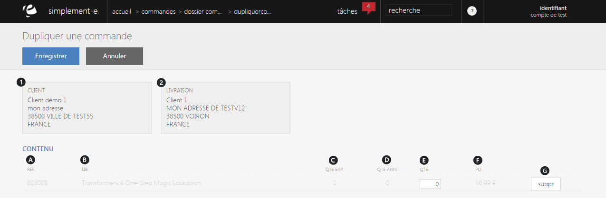

# Dupliquer la commande

<strong>Ce formulaire vous permet de dupliquer une commande,</strong> pour cela, il vous suffit de cliquez sur le bouton bleu <strong>Enregistrer</strong> afin de dupliquer une commande.

Dans ce formulaire, vous pouvez apercevoir :

<ol>
<li>Le nom et l'adresse du client</li>
<li>Le nom et l'adresse de livraison du client</li>
</ol>

Vous verrez aussi le contenu de cette commande :

<ol type="a">
<li>La r&eacute;f&eacute;rence des produit de la commande</li>
<li>Le libell&eacute; des produits</li>
<li>La quantit&eacute; exp&eacute;di&eacute;</li>
<li>La quantit&eacute; annul&eacute;</li>
<li>La quantit&eacute; des produits dans cette commande</li>
<li>Le prix unitaire</li>
<li>Un lien de suppression d'un article de la commande</li>
</ol>

&nbsp;

