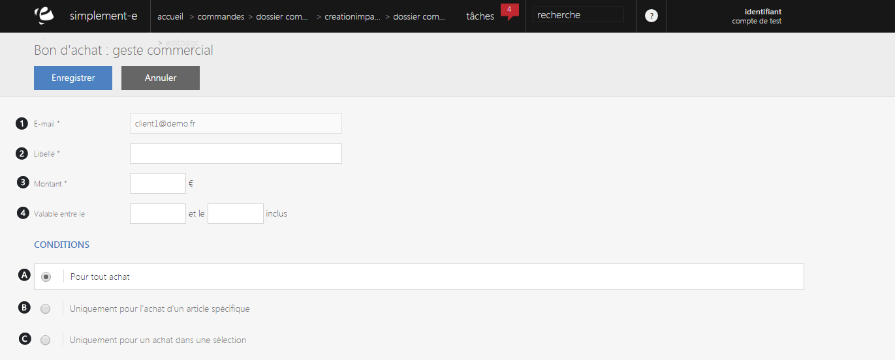
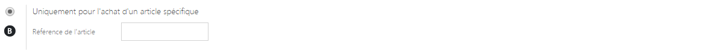
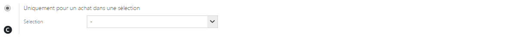

# Creer un bon d'achats

Ce <strong>formulaire va vous permettre de cr&eacute;er un bon d'achat</strong>.

Un bon d'achat se cr&eacute;&eacute; via certaines conditions, vous pouvez voir dans ce formulaire de cr&eacute;ation :

<ol>
<li>L'e-mail du client</li>
<li>Le libell&eacute; de ce bon d'achat</li>
<li>Le montant de celui-ci</li>
<li>Sa date de validit&eacute;</li>
</ol>

La cr&eacute;ation d'un bon d'achat se fait selon certaines conditions :

<ol type="a">
<li>Offre valable pour tout les achats</li>
</ol>

&nbsp;&nbsp;&nbsp;&nbsp;&nbsp;&nbsp;&nbsp; b.&nbsp; Offre valable uniquement pour un achat sp&eacute;cifique

&nbsp;&nbsp;&nbsp;&nbsp;&nbsp;&nbsp;&nbsp; c.&nbsp; Offre valable uniquement pour un achant dans une s&eacute;lection

Une fois ces donn&eacute;es remplis, cliquez sur le bouton bleu <strong>Enregistrer</strong> pour cr&eacute;er votre bon d'achat.

