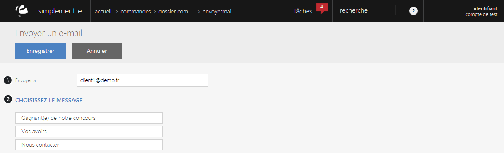

# Envoyer un e-mail

Ce formulaire va vous permettre <strong>d'envoyer un e-mail &agrave; un client</strong>.

Pour cela, il vous suffit de saisir l'adresse mail du client (1) et d'&eacute;crire le message que vous souhaitez lui faire parvenir.

Pour &eacute;crire un message, vous devez choisir un des messages situ&eacute; en dessous de son libell&eacute;. (2)

Lorsque vous aurez choisi un message, vous serez redirig&eacute; vers un formulaire ou vous pourrez le <strong>modifier</strong> et <strong>l'envoyer </strong>&agrave; votre destinataire.

&nbsp;

&nbsp;

