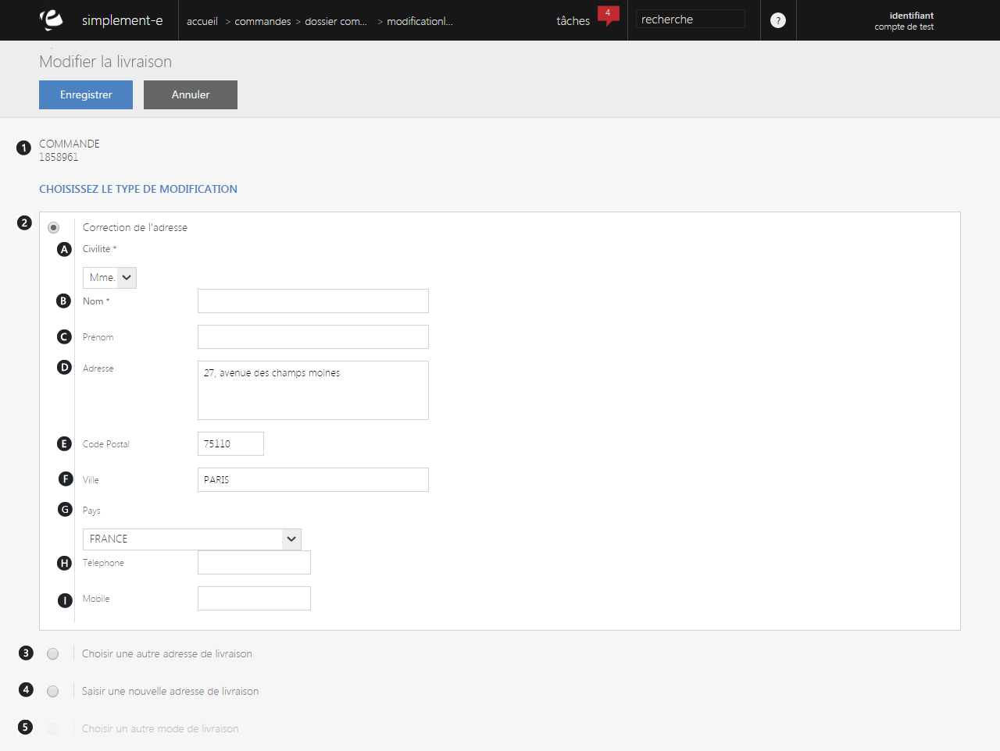

# Modification livraison

Ce formulaire va vous <strong>permettre de modifier votre adresse de livraison</strong>.

Vous pourrez :

- Modifier votre adresse actuelle,

- Choisir une autre adresse de livraison,

- Saisir une nouvelle adresse,

- Choisir un autre mode de livraison.

Vous pouvez voir dans ce formulaire :

<ol>
<li>Le <strong>num&eacute;ro de commande</strong></li>
<li>La <strong>partie correction de votre adresse de livraison</strong></li>
<li>Le<strong> choix d'une autre adresse de livraison</strong></li>
<li>La<strong> saisie d'une nouvelle adresse de livraison</strong></li>
<li>Le<strong> choix d'un autre mode de livraison</strong></li>
</ol>

Vous pouvez voir dans chacun de ses choix d'adresse, les crit&egrave;res suivant :

<ol type="a">
<li>La <strong>civilit&eacute;</strong> (Monsieur, Madame),</li>
<li>Le <strong>nom du client</strong>,</li>
<li>Son <strong>pr&eacute;nom</strong>,</li>
<li>Son <strong>adresse</strong>,</li>
<li>Son <strong>code postal</strong>,</li>
<li>Sa <strong>ville</strong>,</li>
<li>Son <strong>pays</strong>,</li>
<li>Son <strong>num&eacute;ro de t&eacute;l&eacute;phone</strong>,</li>
<li>Son <strong>mobile</strong>.</li>
</ol>

Pour valider vos modifications, cliquez sur le bouton bleu <strong>Enregistrer</strong>.&nbsp;

