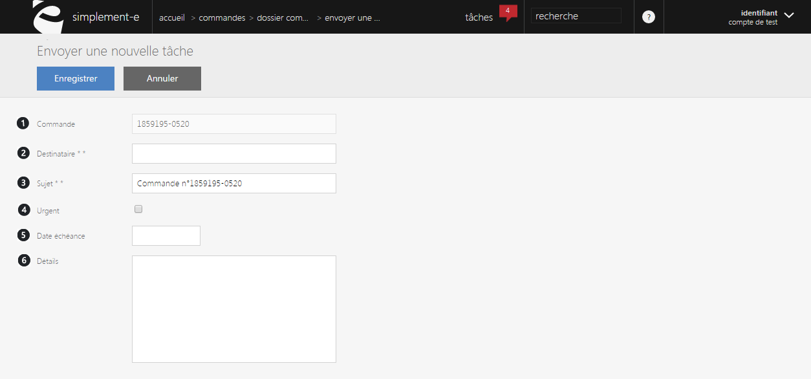

# Formulaire nouvelle tâche

Ce <strong>formulaire va vous permettre de cr&eacute;er et d'envoyer une t&acirc;che</strong>.

Cette <strong>t&acirc;che correspondra au traitement d'une commande</strong>.

Vous aurez dans cette t&acirc;che :

<ol>
<li>Le num&eacute;ro de la commande &agrave; traiter</li>
<li>Le destinataire de cette t&acirc;che</li>
<li>Son sujet</li>
<li>Une case permettant de dire si la t&acirc;che est urgente ou non</li>
<li>La date d'&eacute;ch&eacute;ance de cette t&acirc;che</li>
<li>Ses d&eacute;tails et caract&eacute;ristiques</li>
</ol>

Pour enregistrer cette t&acirc;che, cliquez sur le bouton bleu <strong>Enregistrer</strong>, lorsque vous aurez enregistr&eacute;, la t&acirc;che sera envoy&eacute; au destinataire qui devra la traiter dans le d&eacute;lai impartit.

