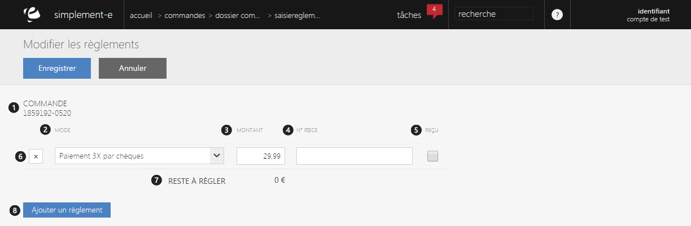

# Saisie réglements

Ce formulaire va vous permettre de <strong>modifier votre mode de r&eacute;glement </strong>pour une commande.

Vous aurez le choix entre plusieurs mode de r&eacute;glement comme :

- La<strong> CB</strong>

- Le <strong>ch&egrave;que</strong>

- Le <strong>bon d'achat</strong>

- Un <strong>avoir</strong>

- Etc...

Vous pourrez apercevoir dans ce formulaire :

<ol>
<li>Le <strong>num&eacute;ro de la commande</strong> pour laquelle vous souhaitez modifier le moyen de paiement</li>
<li>Les <strong>diff&eacute;rents mode de paie</strong>ments (avoir, ch&egrave;que, CB...)</li>
<li>Le <strong>montant de la commande</strong></li>
<li>Le <strong>num&eacute;ro pi&eacute;ces</strong></li>
<li><strong>Case de re&ccedil;u</strong></li>
<li><strong>Lien de suppression</strong> de la commande</li>
<li><strong>Reste &agrave; r&eacute;gler</strong></li>
<li><strong>Lien permettant d'ajouter un mode de r&eacute;glement</strong>.</li>
</ol>

Pour valider vos modification de r&eacute;glement, cliquez sur le bouton bleu <strong>Enregistrer</strong>.

Vous pouvez aussi faire des <strong>gestes commerciaux</strong>, selon le montant d'une commande, vous pouvez accorder un geste commercial &agrave; un client.

<blockquote>

A savoir : le montant du geste commercial est param&egrave;trable

</blockquote>

&nbsp;

&nbsp;

