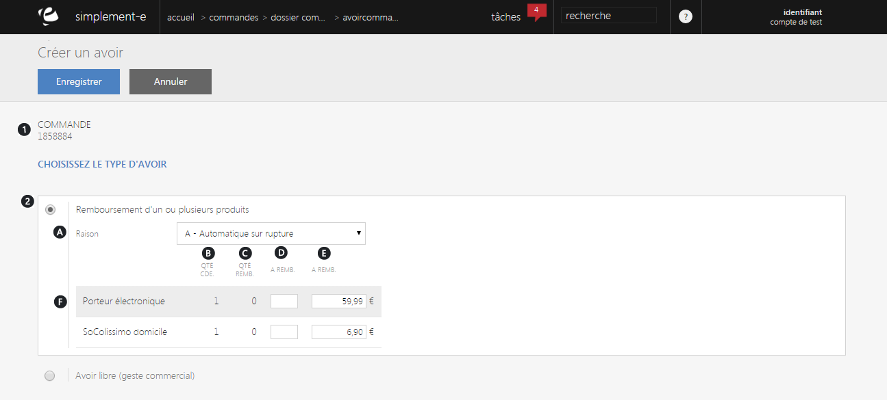
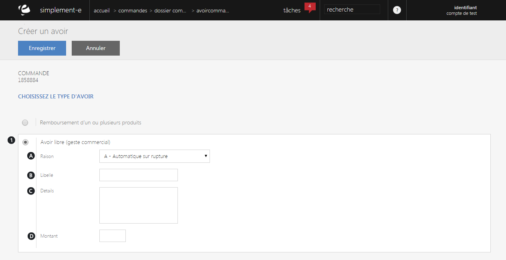

# Etablir un avoir

Ce <strong>formulaire va vous permettre de cr&eacute;er un avoir pour un client</strong>.

Pour cela, vous disposez de deux types d'avoir :

- <strong>Remboursement d'un ou plusieurs produits</strong>

<strong>- Avoir libre ou geste commercial</strong>

<h3>Remboursement d'un ou plusieurs produits</h3>

Ce type d'avoir correspond &agrave; <strong>rembourser un produit ou un groupe de produits</strong>, pour cela il vous suffit de pr&eacute;ciser le montant &agrave; rembourser sur chaque produit.

Vous pouvez voir dans ce type d'avoir :

<ol>
<li>Le <strong>num&eacute;ro de commande</strong></li>
<li>Le <strong>type d'avoir</strong>, un remboursement de produits</li>
</ol>
<ol type="a">
<li>Les <strong>diff&eacute;rentes raisons de ce remboursement</strong> (rupture du produit, produit de mauvaise qualit&eacute;...)</li>
<li>La <strong>quantit&eacute; de commande</strong></li>
<li>La <strong>quantit&eacute; &agrave; rembours&eacute;</strong></li>
<li>Le <strong>montant de ce remboursement</strong></li>
<li>La <strong>somme total</strong> <strong>&agrave; rembourser</strong></li>
</ol>

Lorsque tout les crit&egrave;res ont &eacute;t&eacute;s remplis, cliquez sur <strong>Enregistrer</strong> pour valider l'avoir.

&nbsp;

<h3>Avoir libre</h3>

Ce type d'avoir correspond &agrave; un <strong>geste commercial de la part du site e-commerce</strong>.

Vous pouvez voir dans ce formulaire :

<ol>
<li><strong>Avoir libre</strong> ou <strong>geste commercial</strong></li>
</ol>
<ol type="a">
<li>La <strong>raison de cet avoir</strong> (rupture de stock, vol...)</li>
<li>Le <strong>libell&eacute;</strong> de cet avoir</li>
<li>Ses <strong>d&eacute;tails</strong></li>
<li>Son <strong>montant</strong></li>
</ol>

Pour valider votre avoir, cliquez sur le bouton bleu <strong>Enregistrer</strong>.

&nbsp;

