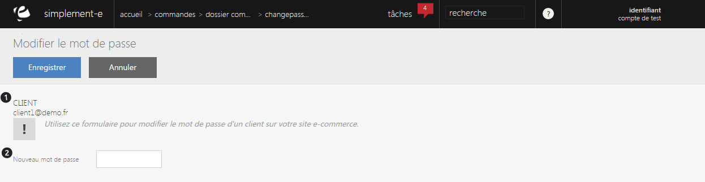

# Changer de mot de passe

Ce formulaire va vous permettre de <strong>modifier le mot de passe d'un client</strong>, pour cela, il vous suffit de pr&eacute;ciser l'adresse mail du client et de cr&eacute;er le nouveau mot de passe.

Vous pouvez voir dans ce formulaire :

<ol>
<li>L'adresse mail du client</li>
<li>Espace de cr&eacute;ation du nouveau mot de passe</li>
</ol>

Pour terminer les modifications, cliquez sur le bouton bleu <strong>Enregistrer</strong>.

&nbsp;

