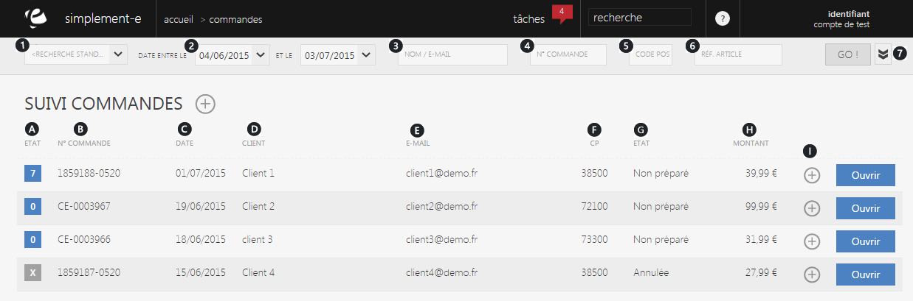
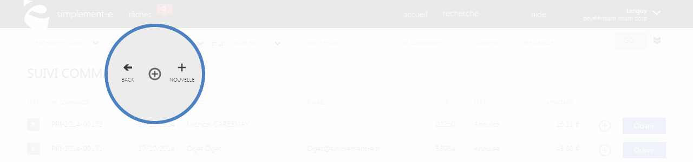

# Suivi des commandes

Cette page&nbsp;vous permet de <strong>visualiser l'int&eacute;gralit&eacute; des commandes de vos clients</strong>.

De cette page, vous pouvez <strong>rechercher une commande</strong> client rapidement gr&acirc;ce &agrave; la <em>barre de recherche</em> situ&eacute; sur le haut de la page.

Vous pouvez aussi <strong>cr&eacute;er</strong> une nouvelle commande via la <strong>commande d'action</strong>.

<h3>Recherche d'une commande client</h3>

Vous pouvez lancer une recherche avec les crit&egrave;res suivants :

<ol>
<li>L'<strong>origine de la commande</strong></li>
<li>Sa <strong>date</strong> d'enregistrement</li>
<li>Le <strong>nom</strong> ou <strong>l'e-mail du client</strong></li>
<li>Le <strong>num&eacute;ro de la commande</strong></li>
<li>Le <strong>code postal</strong> du client</li>
<li>La <strong>r&eacute;f&eacute;rence article</strong></li>
<li>Lien qui permet d'afficher plus de crit&egrave;res de recherche :</li>
</ol>

- Les <strong>diff&eacute;rentes cat&eacute;gories</strong>

<strong>- Cases de recherches avanc&eacute;</strong> (par exemple, rechercher juste les commandes en pr&eacute;paration)

Pour lancer la recherche, cliquez sur le bouton <strong>Go</strong>.

<blockquote>

A savoir : tout les crit&egrave;res ne sont pas obligatoires pour lancer une recherche

</blockquote>

<h3>Vos commandes</h3>

Cette partie vous donne acc&egrave;s &agrave; <strong>l'int&eacute;gralit&eacute; de vos commandes</strong>, elle vous permet de les modifier ou encore d'acc&egrave;der &agrave; l'ensemble de leurs informations.

Ces commandes sont tri&eacute;es selon certains crit&egrave;res :

<ol type="a">
<li>&nbsp;Etat de&nbsp;progression (le nombre d'article en cours de traitement, commande annul&eacute;...) &nbsp;</li>
<li>&nbsp;Son num&eacute;ro de commande &nbsp;&nbsp;</li>
<li>&nbsp;Sa date &nbsp;</li>
<li>&nbsp;Le nom du client &nbsp;</li>
<li>&nbsp;L'e-mail de celui-ci</li>
<li>&nbsp;Son code postal</li>
<li>&nbsp;L'&eacute;tat de la commande (valid&eacute;, annul&eacute;, termin&eacute;)</li>
<li>&nbsp;Le montant</li>
<li>&nbsp;Un menu de commande permettant de duppliquer le suivi&nbsp;</li>
</ol>

Pour acc&eacute;der aux informations d'un suivi de commande, cliquez sur le lien bleu <strong>Ouvrir</strong>.

<h3>Actions</h3>

La&nbsp;<strong>commande d'action</strong>&nbsp;que vous pouvez apercevoir pr&egrave;s du titre, correspond au menu de commande.

Ce menu vous permet d'acc&eacute;der &agrave; diff&eacute;rentes commande qui vous permettront de g&eacute;rer vos articles.

<em>Exemple</em> d'actions que vous pouvez avoir :

<table>
<tbody>
<tr>
<td><strong><a href="/fr-fr/office/gestion-commerciale/ventes/NewTodo.html">Nouvelle</a></strong></td>
<td>Cette action vous permet de cr&eacute;er une nouvelle&nbsp;commande&nbsp;</td>
</tr>
</tbody>
</table>
<h2>&nbsp;Cr&eacute;er une nouvelle commande</h2>

Pour cr&eacute;er une nouvelle&nbsp;commande, cliquez sur la&nbsp;<strong>commande d'action</strong>&nbsp;pr&egrave;s du titre.

&nbsp;

Lorsque vous cliquez sur la&nbsp;<strong>commande d'action</strong>&nbsp;et que vous choisissez <a title="Nouvelle" href="/fr-fr/office/gestion-commerciale/ventes/NewTodo.html"><strong>Nouvelle</strong></a>, vous serez redirig&eacute; vers un <strong>formulaire</strong> vous permettant de cr&eacute;er une nouvelle commande.

Vous pouvez aussi <a title="annuler une commande" href="/fr-fr/office/gestion-commerciale/ventes/AnnulationCommande.html"><strong>annuler une commande</strong> </a>gr&acirc;ce &agrave; la <strong>commande d'action,</strong> vous serez redirig&eacute; vers un formulaire vous permettant d'annuler une commande.

&nbsp;

