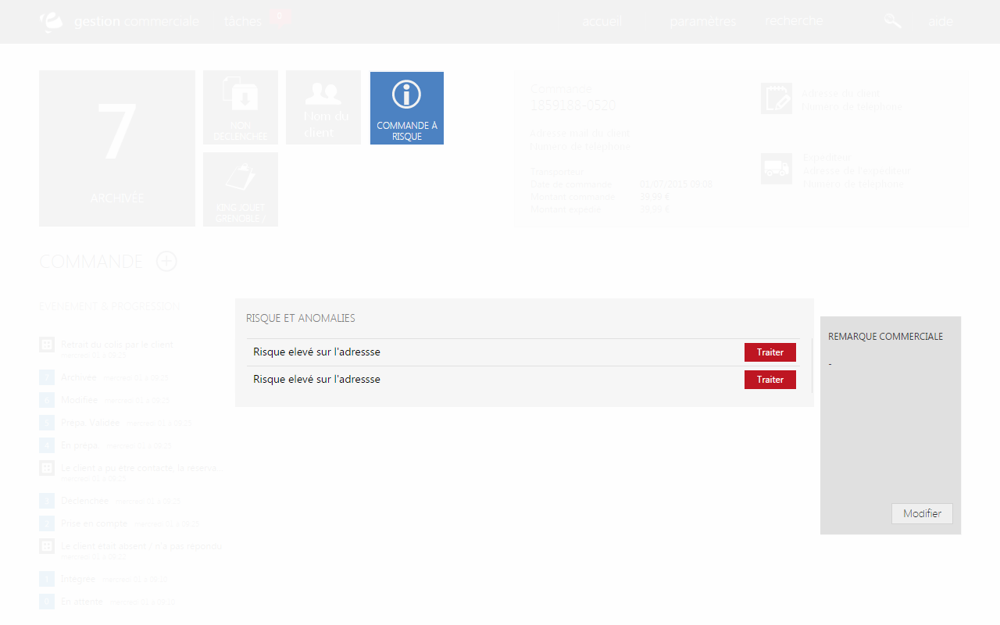

# Information sur le traitement des litiges

Cet onglet vous informe de <strong>l'&eacute;tat de votre commande</strong>.

Lorsque votre commande est trait&eacute; (valid&eacute;, termin&eacute; ou en cour de pr&eacute;paration) votre bloc sera de couleur vert.

En revanche, lorsque votre commande est consid&eacute;r&eacute;e comme risqu&eacute;e, votre bloc deviendra rouge et le descriptif de ces risques se trouvera au milieu de la page.

Lorsque ces risques seront corrig&eacute;s, vous pourrez supprimer ces descriptifs en cliquant sur le lien rouge "<strong>Traiter</strong>", vous serez redirig&eacute; vers une page vous demandant si le probl&egrave;me est r&eacute;gl&eacute;, quand vous cliquerez sur enregistrer, le descriptif du risque disparaitra.

La commande peut toujours &ecirc;tre valid&eacute; et exp&eacute;di&eacute; lorsqu'il s'agit d'un risque, en revanche, lors d'un litige, la commande restera bloqu&eacute; jusqu'&agrave; sa r&eacute;solution.

<blockquote>

&nbsp;A savoir : vous trouverez un rectangle gris vous permettant d'inclure une remarque sur la commande

</blockquote>

