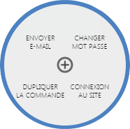

# Interaction client

L'interaction client correspond aux diff&eacute;rentes parties permettant de contacter un client ou encore faire des modifications sur son compte. En cliquant sur le lien "<strong>Client</strong>", vous aurez acc&egrave;s aux diff&eacute;rents th&egrave;mes ci-dessous.

