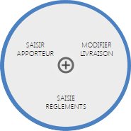
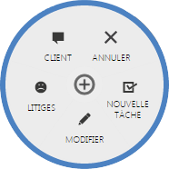

# Modifications

Cet action issu du menu de commande <strong>(+)</strong> permet de modifier les <strong>crit&egrave;res de bases d'une commande</strong>.

Pour acc&eacute;der aux diff&eacute;rents crit&egrave;res de commandes, cliquez sur le lien "<strong>Modification</strong>", vous <strong>retrouverez les diff&eacute;rentes infomations que vous pourrez modifier</strong>.

