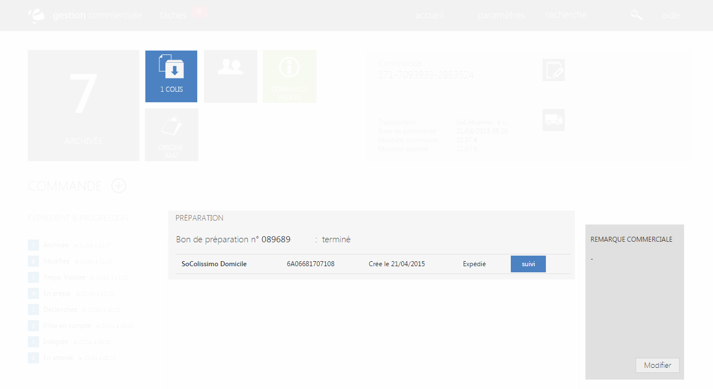

# Onglet préparation

Cette page correspond &agrave; <strong>l'onglet de logistique qui&nbsp;a pour but de vous informer de la pr&eacute;paration de votre commande</strong>, il existe <strong>plusieurs modes de pr&eacute;paration</strong>.

De cette page, vous pourrez apercevoir l'&eacute;tat de votre commande :

- <strong>En pr&eacute;paration</strong>

- <strong>Annul&eacute;</strong>

- <strong>Exp&eacute;di&eacute;</strong>

- <strong>Termin&eacute;</strong>

Si votre commande est exp&eacute;di&eacute;, vous pourrez suivre votre colis via le bouton bleu "<strong>suivi</strong>", vous serez redirig&eacute; vers l'historique d'acheminement de votre commande.

Vous pouvez avoir plusieurs bons de pr&eacute;parations pour une commande, cela correspond au fait d'avoir plusieurs produits dans une seule commande.

<blockquote>

A savoir : vous retrouverez diff&eacute;rents suivis selon le livreur.

&nbsp;A savoir : vous trouverez un rectangle gris vous permettant d'inclure une remarque sur la commande.&nbsp;

</blockquote>

