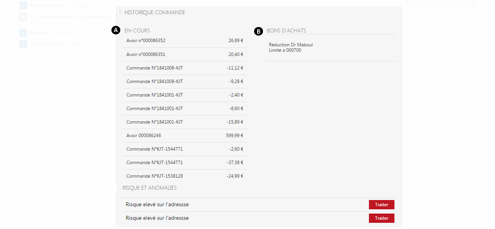

# Onglet principal

<strong>L'onglet principal</strong> s'affichera lorsque vous ouvrirez de dossier de votre&nbsp;commande.

Il s'occupe de g&eacute;rer les <strong>informations g&eacute;n&eacute;rales</strong> d'un produit en pr&eacute;sentant ses <strong>caract&eacute;ristiques</strong>.

<h3>Contenu de la commande</h3>

Le <strong>contenu de la commande correspond aux donn&eacute;es de votre commande</strong>, elles vous permettent de voir le montant de la commande, du nombre de produit command&eacute;, du mode de livraison...

Vous pouvez visualiser les informations suivantes :

<ol>
<li>Articles command&eacute;s</li>
<li>Type de livraison</li>
<li>Montant de l'article</li>
<li>Donn&eacute;es compl&eacute;mentaire (nombre d'article command&eacute;, article annul&eacute;, en pr&eacute;paration..)</li>
<li>Total du montant de la commande</li>
</ol>

Vous pouvez apercevoir sur la droite de la page un bloc rectangulaire vous permettant de mettre une <strong>remarque sur la commande</strong> via le bouton <strong>modifier</strong>. (6)

<blockquote>

A savoir : ce rectangle vous permettant d'&eacute;crire une remarque, appara&icirc;tra dans tout les onglets

</blockquote>
<h3>R&eacute;glements</h3>

Cette partie correspond au <strong>mode de paiement utilis&eacute; par le client</strong> (ch&egrave;ques, CB, liquidit&eacute;..).

Vous pouvez y apercevoir :

<ol type="a">
<li>Le mode de paiement (ch&egrave;que, CB, liquidit&eacute;...)</li>
</ol>
<blockquote>

&nbsp;A savoir : vous trouverez un rectangle gris vous permettant d'inclure une remarque sur la commande.

</blockquote>

<h3>Historique commande</h3>

Cette partie correspond &agrave; l'historique de toute vos autres commandes, vous y apercevrez toute les commandes pass&eacute;es avec leurs montants et les bons d'achats utilis&eacute;s.

<ol type="a">
<li>Commandes pass&eacute;s</li>
<li>Bons d'achats utilis&eacute;s</li>
</ol>
<h3>Echanges</h3>

Vous pourrez retrouver dans cette partie tout les &eacute;changes fait entre vous et le fournisseur.

Pour acc&eacute;der &agrave; vos &eacute;changes (mails, confirmation de commande...), cliquez sur le bouton "<strong>Voir</strong>".

<h3>En-cours&nbsp;</h3>

Vous pourrez voir dans cette partie le nombre d'en-cours dont vous disposez.

Un en-cours correspond &agrave; un avoir utilisable ou &agrave; un montant de cr&eacute;dit accord&eacute; &agrave; un client, celui-ci ne sera pas factur&eacute; tant que son en-cours est encore valable.

<h3>Bon d'achat</h3>

Vous pouvez apercevoir les diff&eacute;rents bons d'achats dont vous diposez et que vous avez utilis&eacute; pour traiter une commande.

<h3>Risques et anomalies</h3>

&nbsp;Les risques et les anomalies correspondent aux risques qui peuvent subvenir lors d'une commande comme :

- Un d&eacute;faut de paiement

- Une livraison tardive

- Etc...

<blockquote>

A savoir : les donn&eacute;es sont param&egrave;trables

</blockquote>

