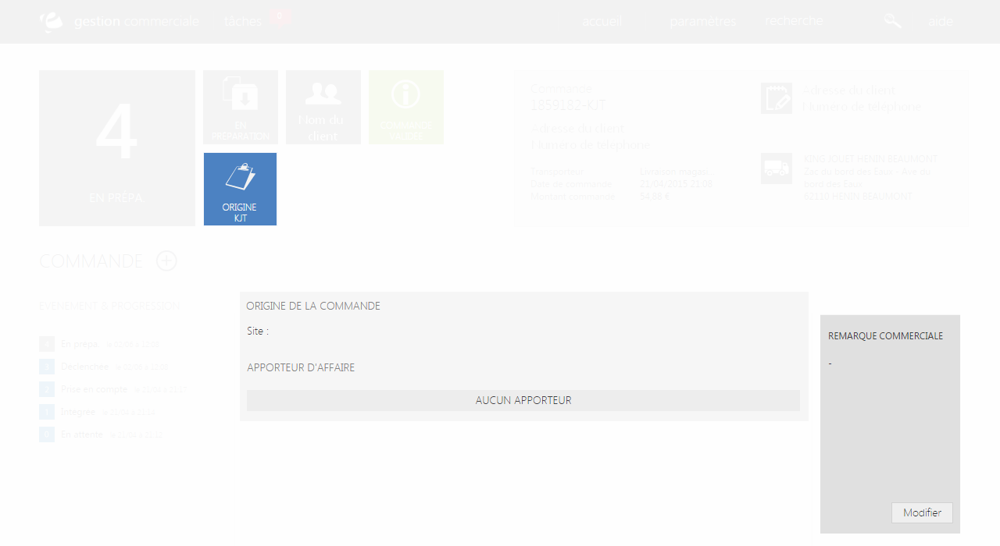

# Origine

Cet onglet va vous permettre de <strong>visualiser les origines de la commande</strong> comme :

- Le <strong>site e-commerce</strong> ou la commande a &eacute;t&eacute; faite

- La <strong>borne,</strong> qui poss&eacute;dera des informations plus d&eacute;taill&eacute;es <em>comme par exemple</em>, le nom du vendeur, la date, l'heure...

- Etc...

Vous pourrez voir par la m&ecirc;me occasion les diff&eacute;rents <strong>apporteurs d'affaire</strong>.

Un apporteur d'affaire est un organisme publicitaire charg&eacute; de "recruter" les clients et les faire visiter un site via les publicit&eacute;s qu'ils affichent.

<blockquote>

&nbsp;A savoir : vous trouverez un rectangle gris vous permettant d'inclure une remarque sur le client.

</blockquote>

