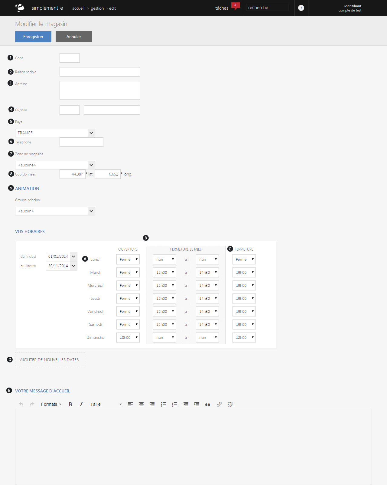

# Editer un magasin

Ce formulaire va vous permettre de **créer un nouveau magasin**.

De cette page, vous pourrez **créer un magasin** en remplissant **les informations de bases** de votre magasin (ville, code postal, téléphone...), **ses horaires** ou encore **écrire un message d'accueil** pour la clientèle.

> A savoir : seul un employé du magasin peut modifier ces informations.

### Informations générales

**Les informations générales** correspondent aux données permettant aux clients de trouver un magasin.

Vous pouvez voir comme données :

1.  Le **code du magasin,**
2.  Sa **raison sociale,**
3.  Son **adresse,**
4.  Son **code postal** et sa **ville,**
5.  Son **pays,**
6.  Son **numéro de téléphone,**
7.  Les **zones de magasins,**
8.  Leurs **coordonnées** (longitude, latitude),
9.  Les **animations** (groupe de magasin, un seul magasin..).

### Vos horaires

Afin d'informer les clients des heures d'ouverture de votre magasin, vous pouvez inclure dans les informations les **horaires d'ouverture** et de **fermeture** de votre enseigne.

1.  **Jours de la semaines**
2.  **Différentes périodes** (periode scolaire, vacance..)
3.  **Horaires** (ouverture/fermeture, fermé)
4.  Lien permettant **l'ajout de nouvelles dates**

### Message d'accueil

Vous pouvez **rédiger un message d'accueil** (E) vous permettant **d'informer votre clientèle** sur un **événement** ou juste pour leur souhaité la bienvenu.

>  A savoir : ce formulaire de création est le même que celui de modification lorsque vous cliquez sur le bouton Ouvrir sur la droite de votre magasin