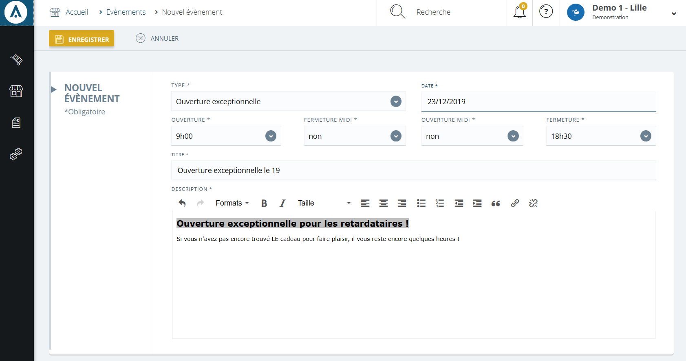

# Création ou modification d'un événement

Pour cr&eacute;er ou modifier un &eacute;v&eacute;nement, cliquez sur la&nbsp;<strong>commande d'action</strong>&nbsp;puis sur "<strong>Nouvel &eacute;v&eacute;nement</strong>" pr&egrave;s du titre.

Vous serez redirig&eacute; vers un <strong>formulaire</strong> d'&eacute;dition vous permettant de cr&eacute;er un nouvel &eacute;v&eacute;nement.

Vous retrouverez dans ce formulaire :

<ol>
<li>Le type d'&eacute;v&eacute;nement commercial, ouverture ou fermeture&nbsp;exceptionnelle d'un magasin.</li>
<li>La date de cr&eacute;ation de cet &eacute;v&eacute;nement, l'&eacute;v&eacute;nement commence &agrave; partir de...</li>
<li>Le titre de cet &eacute;v&eacute;nement.</li>
<li>La description de cet &eacute;v&eacute;nement.</li>
</ol>

Vous pouvez <strong>modifier des &eacute;v&eacute;nements</strong> d&eacute;j&agrave; cr&eacute;&eacute;s, pour cela, il vous suffit de cliquer sur le bouton bleu "<strong>Ouvrir</strong>".

Vous serez redirig&eacute; vers&nbsp;un <strong>formulaire&nbsp;</strong>poss&eacute;dant les&nbsp;informations de votre &eacute;v&eacute;nement&nbsp;et vous pourrez modifier votre &eacute;v&eacute;nement.

