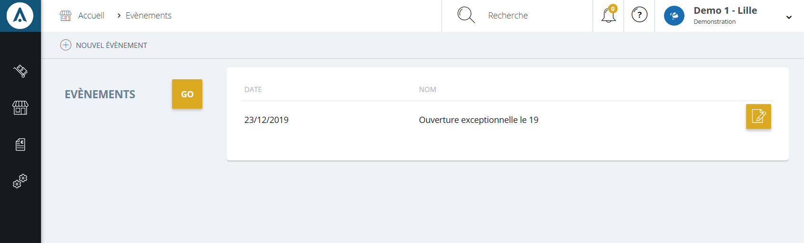

# Vos événements

Un <strong>&eacute;v&eacute;nement</strong> permet d'informer la client&egrave;le qu'une <strong>action exceptionnelle se d&eacute;roulera dans votre magasin</strong>.

L'annonce d'un &eacute;v&eacute;nement exceptionnel sera <strong>directement publi&eacute;e sur le site e-commerce du magasin</strong>.

<blockquote>

A savoir : seul un utilisateur du magasin peut publier un &eacute;v&eacute;nement exceptionnel

</blockquote>
<h3>Actions</h3>

La&nbsp;<strong>commande d'action</strong>&nbsp;que vous pouvez apercevoir pr&egrave;s du titre, correspond au menu de commande.

Il vous permet d'acc&eacute;der &agrave; diff&eacute;rentes actions qui vous permettront de g&eacute;rer vos articles.

<em>Exemple</em> de commande dont vous pouvez disposer :

<table>
<tbody>
<tr>
<td><strong> <a href="/app/points-de-vente/Evenements.aspx/EditEvenment.aspx">Nouvel &eacute;v&eacute;nement</a></strong></td>
<td>Cette action permet d'acc&eacute;der au formulaire vous permettant de cr&eacute;er un nouvel&nbsp;&eacute;v&eacute;nement.&nbsp;</td>
</tr>
</tbody>
</table>

