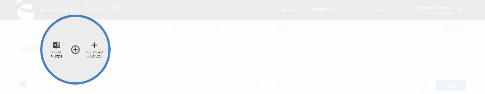

# Recherche et création

La <strong>page magasin</strong> vous permet de <strong>visualiser tout les points de ventes et leur localisation</strong>.

Vous retrouverez dans cette page les diff&eacute;rents magasins du pays.

Vous pourrez retrouver un magasin via la <em>barre de recherche</em> situ&eacute; sur le haut de la page.

De cette page, vous pourrez aussi <strong>cr&eacute;er</strong> ou <strong>modifier</strong> un magasin.

<h3>Recherche d'un magasin</h3>

Vous pouvez lancer une recherche de magasin avec les crit&egrave;res suivants :

<ol>
<li>Le <strong>code</strong> du magasin</li>
<li>Son <strong>libell&eacute;</strong> (le nom de l'enseigne)</li>
<li>Son <strong>code postal</strong></li>
<li>Sa <strong>zone d'activit&eacute;</strong></li>
</ol>

Pour lancer la recherche, cliquez sur le bouton de lancement <strong>Go</strong> (5)

Ces crit&egrave;res vous permettront de rechercher une s&eacute;lection rapidement en rentrant les informations dont vous disposez.

<blockquote>

A savoir : tout les crit&egrave;res ne sont pas obligatoires pour une recherche

</blockquote>
<h3>Vos magasins</h3>

Cette partie vous donne acc&egrave;s &agrave; <strong>l'int&eacute;gralit&eacute; de vos magasins</strong>, elle vous permet de les modifier ou encore d'acc&eacute;der &agrave; l'ensemble de leurs informations.

Vous pourrez voir :

<ol type="a">
<li>Le <strong>code</strong> du magasin</li>
<li>Son <strong>nom</strong></li>
<li>Son <strong>code postal</strong></li>
<li>Sa <strong>ville</strong></li>
<li>Sa <strong>zone d'activit&eacute;</strong></li>
<li>Son <strong>menu de commande</strong> qui permet <strong>d'archiver</strong> un magasin</li>
</ol>

Pour modifier ou acc&eacute;der aux informations, cliquez sur le lien bleu <strong>Ouvrir</strong> (G)

<h3>Actions</h3>

La&nbsp;<strong>commande d'action</strong>&nbsp;que vous pouvez apercevoir pr&egrave;s du titre, correspond au menu de commande.

Ce menu vous permet d'acc&eacute;der &agrave; diff&eacute;rentes commande qui vous permettront de g&eacute;rer vos articles.

<em>Exemple</em> de commande que vous pouvez avoir :

<table>
<tbody>
<tr>
<td><a title="Nouveau magasin" href="/fr-fr/office/gestion-commerciale/magasins/Edit.aspx/formulairededition.aspx"><strong>&nbsp;Nouveau magasin</strong></a></td>
<td>&nbsp;Cette action vous permet de cr&eacute;er un nouveau magasin</td>
</tr>
<tr>
<td><a title="Modification rapide" href="/fr-fr/office/gestion-commerciale/magasins/Edit.aspx/formulairedemodification.aspx"><strong>&nbsp;Modification rapide</strong></a></td>
<td>

&nbsp;Cette action permet de modifier rapidement les informations d'un magasin

</td>
</tr>
</tbody>
</table>

<h2>Cr&eacute;er ou modifier un magasin</h2>
<h3>Cr&eacute;er un magasin</h3>

Pour cr&eacute;er un nouveau magasin, cliquez sur la&nbsp;<strong>commande d'action</strong>&nbsp;pr&egrave;s du titre.

Lorsque vous cliquerez sur la&nbsp;<strong>commande d'action,</strong> vous aurez le choix entre plusieurs actions :

<table>
<tbody>
<tr>
<td><a title="Nouveau magasin" href="/fr-fr/office/gestion-commerciale/magasins/Edit.aspx/formulairededition.aspx"><strong>&nbsp;Nouveau magasin</strong></a></td>
<td>Cette action vous permettra de cr&eacute;er un nouveau magasin&nbsp;</td>
</tr>
<tr>
<td><a title="Modification rapide" href="/fr-fr/office/gestion-commerciale/magasins/Edit.aspx/formulairedemodification.aspx"><strong>&nbsp;Modification rapide</strong></a></td>
<td>Cette actiohn vous permettra de modifier un magasin d&eacute;j&agrave; existant</td>
</tr>
<tr>
<td><strong>&nbsp;Etc...</strong></td>
<td>&nbsp;</td>
</tr>
</tbody>
</table>

Apr&egrave;s avoir choisis une action, vous serez redirig&eacute; vers un <strong>formulaire</strong> vous permettant de d&eacute;buter la cr&eacute;ation de votre <strong>nouveau magasin</strong> ou la <strong>modification d'une enseigne d&eacute;j&agrave; existante.</strong>

