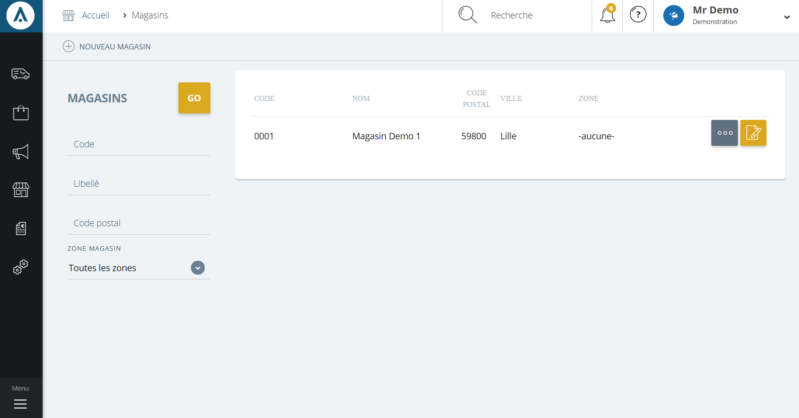

# Recherche et création

La **page magasin** vous permet de **visualiser tout les points de ventes et leur localisation**.

Vous retrouverez dans cette page les différents magasins du pays.

Vous pourrez retrouver un magasin via la _barre de recherche_ situé sur la gauche ou sur le haut de la page.

Depuis cette page, vous pourrez aussi **créer** ou **modifier** un magasin.

### Recherche d'un magasin

Vous pouvez lancer une recherche de magasin avec les critères suivants :

1.  Le **code** du magasin
2.  Son **libellé** (son nom)
3.  Son **code postal**
4.  Sa **zone du magasin**
5. Les services principaux que le magasin doit proposer.

Pour lancer la recherche, cliquez sur le bouton de lancement **Go** (5)

Ces critères vous permettront de rechercher une sélection rapidement en rentrant les informations dont vous disposez.

> A savoir : tout les critères ne sont pas obligatoires pour une recherche

### Vos magasins

Cette partie vous donne accès à **l'intégralité de vos magasins**, elle vous permet de les modifier ou encore d'accéder à l'ensemble de leurs informations.

Vous pourrez voir :

1.  Le **code** du magasin
2.  Son **nom**
3.  Son **code postal**
4.  Sa **ville**
5.  Sa **zone d'activité**
6.  Si vous avez définit des services magasins principaux, vous retrouverez une colonne pour chacun d'entre eux (dans la copie ci-dessus : le service "Click'n'Collect")
7.  Son **menu de commande** qui permet **d'archiver** un magasin

Pour modifier ou accéder aux informations, cliquez sur le lien bleu **Ouvrir** (G)

### Actions

La **commande d'action** que vous pouvez apercevoir près du titre, correspond au menu de commande.

Ce menu vous permet d'accéder à différentes commandes qui vous permettront de gérer vos articles.

|Action||
|---|---|
|[Nouveau magasin](/fr-fr/office/gestion-commerciale/magasins/Edit.md/formulairededition.md "Nouveau magasin")|Cette action vous permet de créer un nouveau magasin| 

<!-- |[** Modification rapide**](/fr-fr/office/gestion-commerciale/magasins/Edit.md/formulairedemodification.md "Modification rapide")|Cette action permet de modifier rapidement les informations d'un magasin| -->

Après avoir choisis une action, vous serez redirigé vers un **formulaire** vous permettant de débuter la création de votre **nouveau magasin** ou la **modification d'une enseigne déjà existante.**