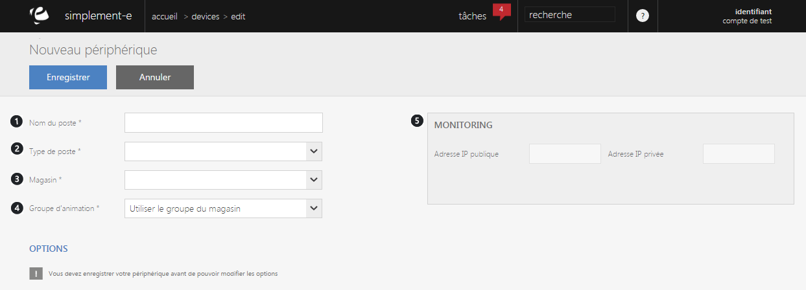

# Nouveau périphérique

Cette page vous permet de <strong>cr&eacute;er un nouveau p&eacute;riph&eacute;rique</strong>.

Pour cr&eacute;er un nouveau poste, vous aurez les informations suivantes :

<ol>
<li>Le nom du p&eacute;riph&eacute;rique,</li>
<li>Son type de poste (caisse ou borne)</li>
<li>Le magasin,</li>
<li>Le groupe d'animation,&nbsp; c'est un ensemble de magasin qui peuvent recevoir la m&ecirc;me animation commerciale.</li>
<li>Monitoring, vous permet de&nbsp;d&eacute;finir les options disponible dans cette liste via les &eacute;cran de configuration des types de p&eacute;riph&eacute;riques.</li>
</ol>

Lorsque les crit&egrave;res seront remplis, cliquez sur le bouton <strong>Enregistrer</strong> afin de valider et de cr&eacute;er votre nouveau p&eacute;riph&eacute;rique.

<blockquote>

A savoir : pour modifier les options d'un p&eacute;riph&eacute;rique, celui-ci doit &ecirc;tre cr&eacute;&eacute;.

</blockquote>

