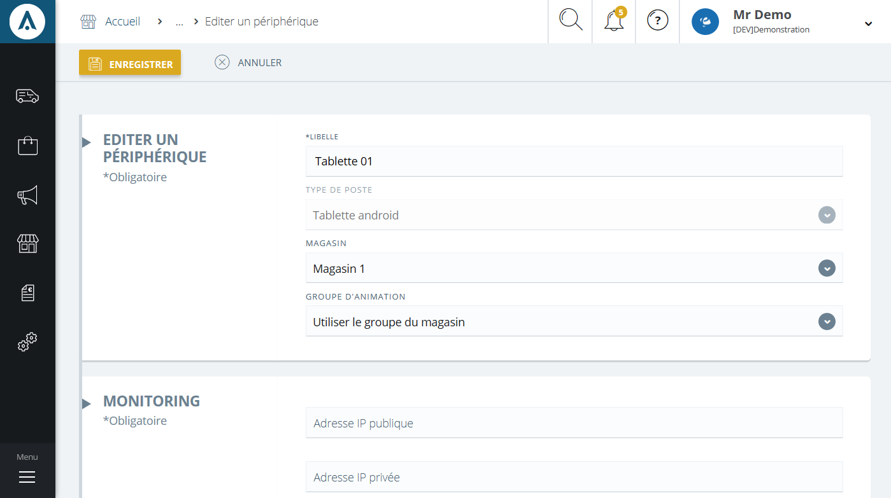

# Nouveau périphérique

Cette page vous permet de **créer un nouveau périphérique**.

Pour créer un nouveau poste, vous aurez les informations suivantes :

1.  Le nom du périphérique,
2.  Son type de poste (caisse ou borne)
3.  Le magasin,
4.  Le groupe d'animation,  c'est un ensemble de magasin qui peuvent recevoir la même animation commerciale.
5.  Monitoring, vous permet de définir les options disponible dans cette liste via les écran de configuration des types de périphériques.

Lorsque les critères seront remplis, cliquez sur le bouton **Enregistrer** afin de valider et de créer votre nouveau périphérique.

> A savoir : pour modifier les options d'un périphérique, celui-ci doit être créé.