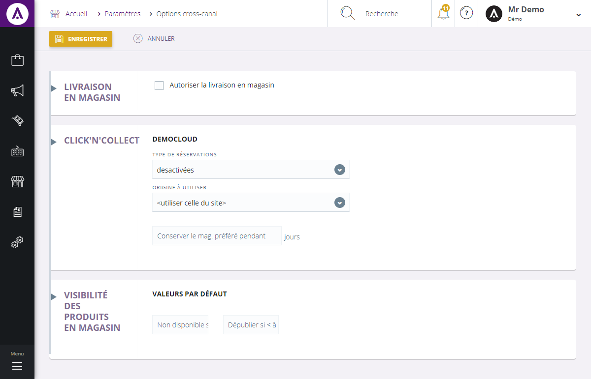

# Vos options

L'&eacute;cran de configuration des <strong>options cross-canal vous permet d'activer les fonctionnalit&eacute;es magasin</strong> au sein de votre site e-commerce, telles que :

- Le click'n'Collect (e-r&eacute;servation),

- La livraison en magasin,

- Etc...

Ce <strong>formulaire</strong> vous permet donc de g&eacute;rer les options magasin, vous pouvez y voir :

<ol>
<li>La case autorisant la livraison en magasin,</li>
</ol>
<h3>L'option Click'n'Collect&nbsp;</h3>

Le&nbsp;Click'n'Collect&nbsp;permet de <strong>r&eacute;server un article sur un site e-commerce et de le payer en magasin</strong>.

&nbsp;&nbsp;&nbsp;&nbsp;&nbsp; 2.&nbsp; Les diff&eacute;rents types de r&eacute;servations d'un article (pay&eacute;es en magasin, pay&eacute;es sur le site e-commerce, d&eacute;sactiv&eacute;),

&nbsp;&nbsp;&nbsp;&nbsp;&nbsp; 3.&nbsp; Les origines de la commande (site ou magasin&nbsp;o&ugrave; la commande a &eacute;t&eacute; pass&eacute;),

&nbsp;&nbsp;&nbsp;&nbsp;&nbsp; 4.&nbsp; Temps de conservation du magasin pr&eacute;f&egrave;r&eacute; (en nombre de jours).

<h3>L'option de visibilit&eacute; des produits en magasin</h3>

Cette option permet de d&eacute;finir la visibilit&eacute; des produits selon leur quantit&eacute; disponible en magasin.

<ol type="a">
<li>La valeurs par d&eacute;faut correspond &agrave; la visibilit&eacute; des produits pour la majorit&eacute; des zones, deux crit&egrave;res permettent de d&eacute;finir la visibilit&eacute; du produit en magasin :</li>
</ol>

- "<strong>Non disponible si &lt; &agrave;</strong>", permet de d&eacute;finir la quantit&eacute; minimum &agrave; partir du quelle le produit sera consid&eacute;r&eacute; comme non disponible.

- "<strong>D&eacute;publier si &lt; &agrave;</strong>", d&eacute;fini la quantit&eacute; qui d&eacute;publiera le produit dans un magasin.

Les zones 1, 2 et 3 correspondent &agrave; trois zones de magasin et poss&eacute;dant elles aussi une quantit&eacute; minimum de non-disponibilit&eacute; et de d&eacute;publication.

&nbsp;

&nbsp;

&nbsp;

&nbsp;

&nbsp;

