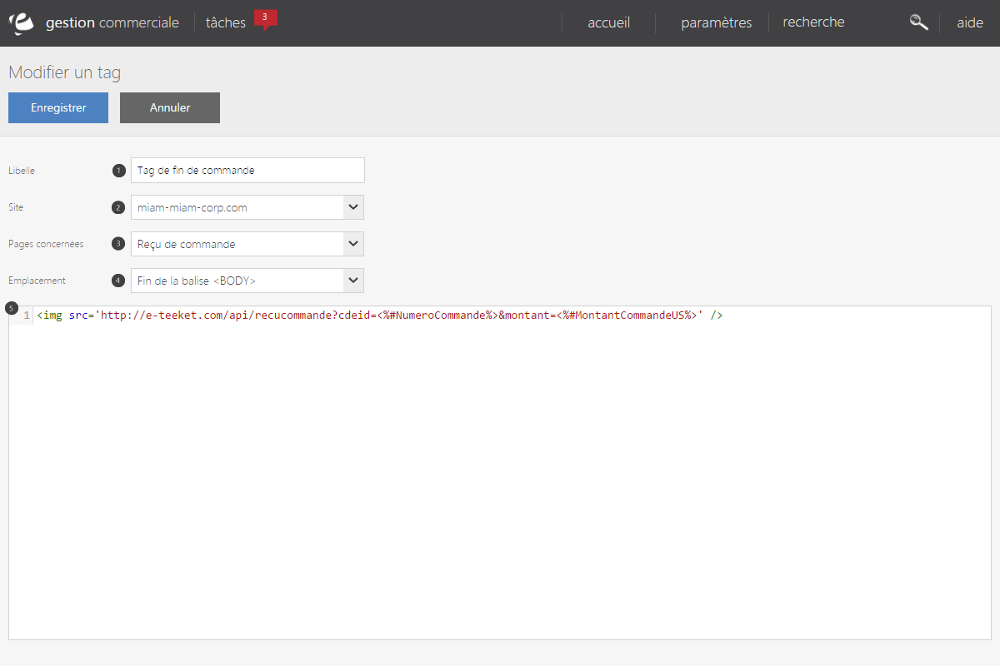

# Formulaire d'édition d'un tag de tracking

Ce formulaire va vous permettre de cr&eacute;er ou modifier un <a href="default.aspx">tag de tracking personnalis&eacute;</a>.

<blockquote>

Les tags Google Analytics sont g&eacute;r&eacute;s directement par notre moteur, vous n'avez pas besoin de les param&egrave;trer via cette interface : activez simplement le module <a href="../Google/Analytics.aspx">Google Analytics</a> pour commencer &agrave; les utiliser.

</blockquote>

Vous devrez renseigner les informations suivantes :

<ol>
<li>Un libell&eacute; pour identifier votre tag</li>
<li>Le site sur lequel le tag sera implant&eacute;</li>
<li>La ou les pages qui recevront le tag</li>
<li>L'emplacement du tag dans la page</li>
<li>Le code HTML du tag.</li>
</ol>
<h2>Page d'affichage</h2>

Lorsque vous implantez un code de tracking, il est fr&eacute;quent de n'avoir &agrave; le placer que sur certaines pages de votre site e-commerce. Par exemple, un tag de remarketing se place le plus souvent sur une fiche produit : seule cette page contient des informations qui sont pertinentes. Vous pouvez choisir d'afficher un tag sur l'une des pages suivantes :

<ul>
<li>La fiche produit</li>
<li>La descente produit (c'est &agrave; dire toute page qui affiche une liste de produits, soit &agrave; la suite d'une recherche ou de l'utilisation d'une facette/d'un crit&egrave;re)</li>
<li>Le panier</li>
<li>La page de connexion client</li>
<li>Les pages de tunnels de commande</li>
<li>Le re&ccedil;u de commande</li>
<li>L'int&eacute;gralit&eacute; des pages du site</li>
</ul>

Si votre tag doit &ecirc;tre plac&eacute; sur d'autres &eacute;l&eacute;ments, merci de contacter le support technique.

<h2>Emplacement du tag</h2>

Lorsque votre partenaire vous a fourni le code du tag, il vous a probablement pr&eacute;cis&eacute; &agrave; quel endroit, dans votre page, le tag doit &ecirc;tre plac&eacute;. La grande majorit&eacute; des tags sont &agrave; placer soit en d&eacute;but ou en fin de la balise HTML &lt;body&gt;.

<h2>Code de votre tag</h2>

C'est dans cette zone que vous allez placer le contenu de votre tag. Attention, &agrave; l'exception de quelques remplacements automatiques, le tag est copi&eacute; tel quel dans votre page, veillez donc &agrave; bien recopier l'int&eacute;gralit&eacute; du tag, y compris les &eacute;ventuelles balises &lt;script&gt; qui l'entourent.

<h3>Valeurs&nbsp;calcul&eacute;es</h3>

Pour vous aider &agrave; r&eacute;aliser votre tag, notre&nbsp;outil vous propose un certain nombre de "remplacements automatiques" : en utilisant une syntaxe sp&eacute;cifique, certaines seront automatiquement calcul&eacute;es en fonction de la session de votre client (par exemple, &lt;%#NumeroCommande%&gt; sera remplac&eacute; par le v&eacute;ritable num&eacute;ro de commande dans la page HTML r&eacute;sultante). La liste des codes est la suivantes

<table class="codeparams">
<tbody>
<tr>
<td>&lt;%#GuidCommande%&gt;</td>
<td>L'identifiant interne (guid) de la commande.</td>
</tr>
<tr>
<td>&lt;%#GuidClient%&gt;</td>
<td>L'identifiant interne (guid) du client</td>
</tr>
<tr>
<td>&lt;%#NumeroCommande%&gt;</td>
<td>Le num&eacute;ro de la commande</td>
</tr>
<tr>
<td>&lt;%#NombreArticles%&gt;</td>
<td>Le nombre d'article (somme de toutes les quantit&eacute;s des produits, hors frais de port, produits avantages et services)</td>
</tr>
<tr>
<td>&lt;%#NombreReferences%&gt;</td>
<td>Le nombre de r&eacute;f&eacute;rences diff&eacute;rentes</td>
</tr>
<tr>
<td>&lt;%#MontantCommandeHT%&gt;</td>
<td>Le montant HT de la commande, incluant frais de port, remises et services compl&eacute;mentaires, s&eacute;parateur d&eacute;cimal en fonction de la langue de l'utilisateur</td>
</tr>
<tr>
<td>&lt;%#MontantCommandeHTUS%&gt;</td>
<td>Comme ci-dessus, au format am&eacute;ricain (s&eacute;parateur d&eacute;cimal ".")</td>
</tr>
<tr>
<td>&lt;%#MontantCommande%&gt;</td>
<td>Le montant TTC de la commande, incluant frais de port, remises et services compl&eacute;mentaires, s&eacute;parateur d&eacute;cimal en fonction de la langue de l'utilisateur</td>
</tr>
<tr>
<td>&lt;%#MontantCommandeUS%&gt;</td>
<td>Idem, au format am&eacute;ricain (s&eacute;parateur d&eacute;cimal ".")</td>
</tr>
<tr>
<td>&lt;%#MontantArticlesHT%&gt;</td>
<td>Le montant HT&nbsp;des articles (sans les frais de port, remises, etc) s&eacute;parateur d&eacute;cimal en fonction de la langue de l'utilisateur</td>
</tr>
<tr>
<td>&lt;%#MontantArticlesHTUS%&gt;</td>
<td>Idem, au format am&eacute;ricain (s&eacute;parateur d&eacute;cimal ".")</td>
</tr>
<tr>
<td>&lt;%#MontantArticles%&gt;</td>
<td>Le montant TTC des articles (sans les frais de port, remises, etc)&nbsp;s&eacute;parateur d&eacute;cimal en fonction de la langue de l'utilisateur</td>
</tr>
<tr>
<td>&lt;%#MontantArticlesUS%&gt;</td>
<td>Idem, au format am&eacute;ricain (s&eacute;parateur d&eacute;cimal ".")</td>
</tr>
</tbody>
</table>

Attention,&nbsp;les codes doivent &ecirc;tre utilis&eacute;s parfaitement &agrave; l'identique de ceux donn&eacute;s dans cette liste : aucun espace suppl&eacute;mentaire, aucune modification de la casse (majuscules/miniscules) ne sera admise. Si vous op&eacute;rez la moindre modification sur ces codes, ils seront laiss&eacute;s tels que vous les aurez saisi dans le tag final.

En compl&eacute;ment de ces tags fixes, il existe quelques tags pouvant &ecirc;tre l&eacute;g&egrave;rement modifi&eacute;s :

<table class="codeparams">
<tbody>
<tr>
<td>&lt;%#Cookie:<em>{nom_cookie}</em>%&gt;</td>
<td>La valeur du&nbsp;cookie portant le nom <em>{nom_cookie}</em></td>
</tr>
<tr>
<td>&lt;%#ArticlesRefs:<em>{s&eacute;parateur}</em>%&gt;</td>
<td>La liste des r&eacute;f&eacute;rences produits du panier/de la commande en les s&eacute;parant avec le caract&egrave;re&nbsp;<em>{s&eacute;parateur}&nbsp;</em></td>
</tr>
<tr>
<td>&lt;%#ArticlesQtes:<em>{s&eacute;parateur}</em>%&gt;</td>
<td>La liste des quantit&eacute;s du panier/de la commande en les s&eacute;parant avec le caract&egrave;re {s&eacute;parateur}</td>
</tr>
<tr>
<td>&lt;%#ArticlesPrix:<em>{s&eacute;parateur}</em>%&gt;</td>
<td>La liste des prix (s&eacute;parateur d&eacute;cimal en fonction de la langue de l'utilisateur)&nbsp;du panier/de la commande en les s&eacute;parant avec le caract&egrave;re {s&eacute;parateur}&nbsp;</td>
</tr>
<tr>
<td>&lt;%#ArticlesPrixUS:<em>{s&eacute;parateur}</em>%&gt;</td>
<td>La liste des prix (s&eacute;parateur d&eacute;cimal ".") du panier/de la commande en les s&eacute;parant avec le caract&egrave;re {s&eacute;parateur}</td>
</tr>
</tbody>
</table>

Comme pour les tags "fixes", la casse et les espacements sont importants : les seules modifications possibles sont le remplacement du param&egrave;tre&nbsp;<em>{entre accolades}</em>. Par exemple :&nbsp;

<ul>
<li>&lt;%#Cookie:userId%&gt;</li>
<li>&lt;%#ArticlesPrix:,%&gt;</li>
<li>La chaine &lt;%#ArticlesPrix : ,%&gt; n'est pas valide</li>
</ul>

Si vous avez besoin de plus de possibilit&eacute;s de remplacement, nous mettons &agrave; votre disposition <a href="/helpadmin/contenujavascript.aspx">des objets javascripts que vous pouvez utiliser pour composer vos tags</a>.

<h2>&nbsp;</h2>

