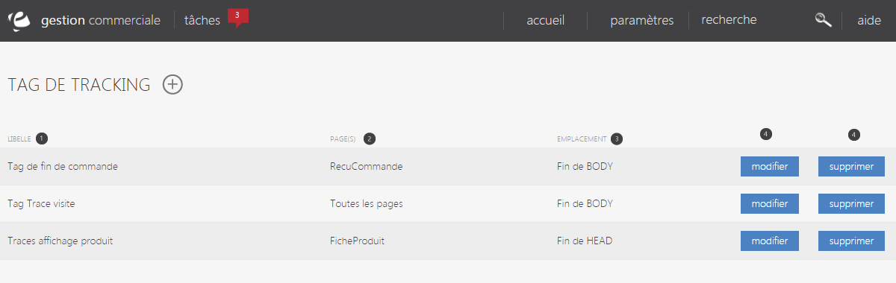

# Liste des tags

Lorsque vous avez recours &agrave; des services tiers, par exemple pour du e-marketing (analyse de consultation, affiliation, publicit&eacute;, remarketing...), le service technique de cette plateforme vous demande, tr&egrave;s souvent,&nbsp;d'ajouter un "extrait de code" dans vos pages pour leur envoyer des donn&eacute;es. Vous pouvez par exemple avoir &agrave; placer une balise &lt;script&gt; dans votre page de re&ccedil;u de commande pour leur confirmer qu'une vente a bien &eacute;t&eacute; r&eacute;alis&eacute;e.

Ce sont ces <em>tags</em> que vous pourrez g&eacute;rer par la fonctionnalit&eacute; <em>Tracking Tag Central</em>.

Vous retrouverez dans cette liste, l'int&eacute;gralit&eacute; des tags de tracking&nbsp;personnalis&eacute;s qui sont en place sur votre (ou vos) site(s).

<blockquote>

Les tags Google Analytics sont g&eacute;r&eacute;s directement par notre moteur, vous n'avez pas besoin de les param&egrave;trer via cette interface : activez simplement le module <a href="../google/analytics.html">Google Analytics</a> pour commencer &agrave; les utiliser.

</blockquote>

Le bouton <strong>(+)</strong> vous permettra les actions suivantes :

<table style="width: 100%;">
<tbody>
<tr>
<td style="width: 150px;">NOUVEAU TAG</td>
<td>Cr&eacute;&eacute; un nouveau tag de tracking</td>
</tr>
</tbody>
</table>
<h2>Liste de r&eacute;sultats</h2>

La liste des tags de tracking pr&eacute;sente :

<ol>
<li>Le libell&eacute; du tag</li>
<li>La ou les page(s) sur lesquelles le tag sera affich&eacute; (cf formulaire d'&eacute;dition d'un tag)</li>
<li>L'emplacement du tag dans la page (cf formulaire d'&eacute;dition d'un tag)</li>
<li>Des boutons&nbsp;de <a href="edittag.html">modification</a> et de suppression.</li>
</ol>

<h2>Tester vos tags</h2>

Comme la plupart des informations techniques, et afin d'optimiser les performances, les tags sont mis en cache et les modifications ne sont pas prises en compte imm&eacute;diatement sur votre site. Pour pouvoir tester facilement, vous pouvez simplement ajouter le param&egrave;tre testtags=1 dans vos urls : le cache sera alors ignor&eacute; et vos modifications prises en compte imm&eacute;diatement.

Par exemple :

http://www.miam-miam-corp.com?testtags=1

http://www.miam-miam-corp.com/gourmandises/patisseries/page1.htm?testtags=1

