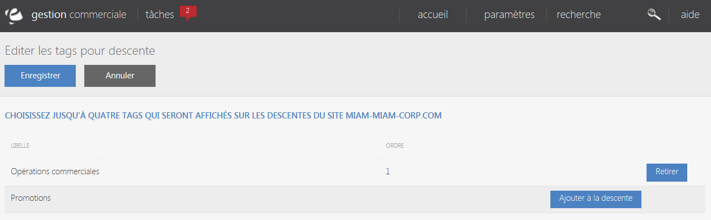
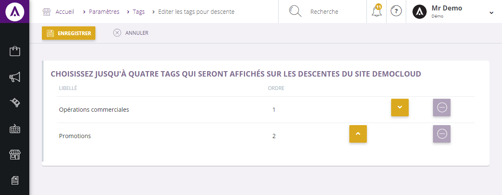

# Choisir les tags affichés dans les descentes

Vous pouvez choisir de un &agrave; quatre tags qui seront ajout&eacute;s dans les descentes produits sur le site. Cette page vous permet de r&eacute;aliser la s&eacute;lection de ces tags.

Cliquez sur <strong>Ajouter &agrave; la descente</strong> pour qu'un tag soit affich&eacute; dans la descente, ou, si il l'est d&eacute;j&agrave;, sur <strong>Retirer</strong> pour l'enlever de la descente.

Si vous avez plusieurs tags visibles sur la descente, vous pouvez choisir l'ordre dans lequel ils s'affichent en utilisant les boutons <strong>Monter</strong> et <strong>Descendre</strong>.

